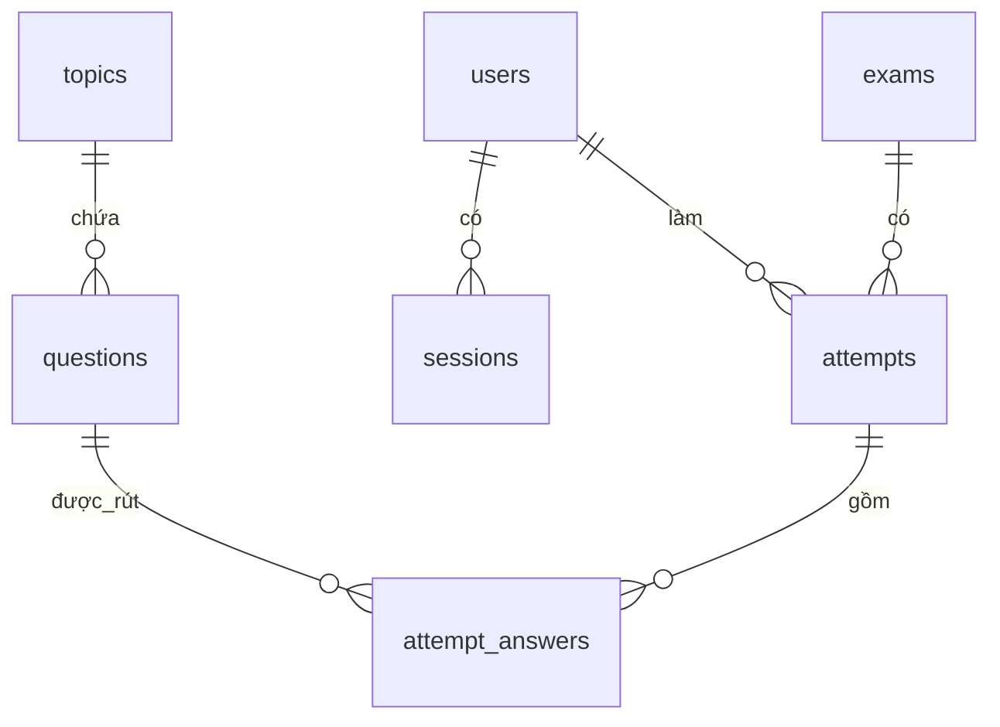
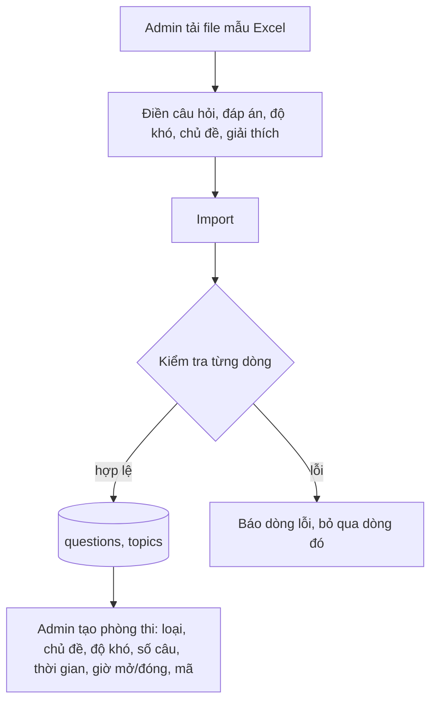
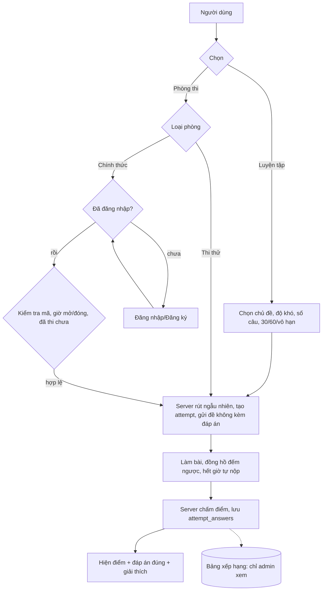

# Thiết kế hệ thống ôn luyện & thi trực tuyến

(Cách chạy xem HUONG-DAN.md. Kiểu dữ liệu: chuỗi tiếng Việt lưu NVARCHAR trên SQL Server.)

## 1. Thiết kế cơ sở dữ liệu
| Bảng | Trường chính | Vai trò |
|---|---|---|
| `users` | username, pass (scrypt), full_name, unit, role (`admin`/`user`) | Tài khoản; `unit` phục vụ thống kê theo đơn vị |
| `sessions` | token, user_id | Phiên đăng nhập |
| `topics` | name | Chủ đề/lĩnh vực (tự tạo khi import) |
| `questions` | topic_id, content, options (JSON), correct (chỉ số), difficulty (1 dễ/2 TB/3 khó), explanation, active, batch | Ngân hàng câu hỏi; `batch` = lần import (để gỡ cả lô), `active` = ẩn câu mà không xoá |
| `exams` | title, kind (`mock`/`official`), code, topic_ids (JSON), difficulty, question_count, duration_min (0 = vô hạn), start_at, end_at, status | Phòng thi do admin tạo |
| `attempts` | id (UUID), exam_id (NULL = luyện tập), user_id (NULL = ẩn danh), mode, duration_min, started_at, submitted_at, time_spent, correct_count, total, score | Một lượt làm bài |
| `attempt_answers` | attempt_id, question_id, pos, chosen, is_correct | Đề đã rút + đáp án chọn (giữ lịch sử ngay cả khi sửa câu hỏi sau này) |

## 2. Luồng nghiệp vụ

## 3. Chức năng hiện có
Import Excel; luyện tập không đăng nhập; chọn chủ đề/độ khó/số câu/30–60 phút/vô hạn; phòng thi thử và chính thức (bắt buộc đăng nhập, mỗi người thi một lần, vào lại được đề cũ nếu làm dở); mã phòng; giờ mở/đóng; chấm điểm trên server (thang 10); giải thích từng câu; bảng xếp hạng chỉ admin xem.

## 4. Cách mở rộng
- **Thêm trường cho câu hỏi** (ví dụ nguồn, hình ảnh, văn bản pháp luật liên quan): thêm cột vào `questions`, thêm cột Excel tương ứng trong hàm `import_questions` (app.py).
- **Thêm dạng câu hỏi** (nhiều đáp án đúng, đúng/sai): thêm cột `type`, đổi `correct` thành mảng chỉ số; chấm điểm nằm gọn trong một hàm `submit` (app.py).
- **Thêm lĩnh vực phân cấp**: thêm `parent_id` vào `topics`.
- **Đề cố định cho mọi thí sinh**: lưu danh sách `question_id` vào `exams` thay vì rút ngẫu nhiên.
- **Chưa làm**: sửa/xoá từng câu hỏi, quản lý người dùng, xuất kết quả ra Excel, đảo thứ tự đáp án, chống chuyển tab. Mỗi mục là một API và một tab mới, không phải sửa phần cũ.
