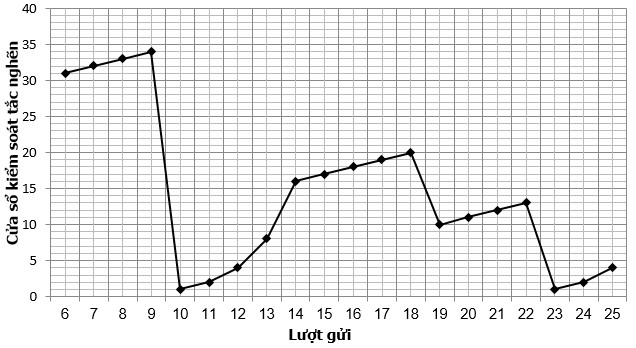

# Câu 1
- **id:** 1
- **type:** single
- **question:** Trong đồ thị định hướng có trọng số sau, độ dài đường đi ngắn nhất từ đỉnh A đến đỉnh D (sử dụng thuật toán Dijkstra) là bao nhiêu?<br><br>```mermaid<br>graph LR<br>  A((A)) -->|4| B((B))<br>  A -->|2| C((C))<br>  B -->|5| D((D))<br>  C -->|1| B<br>  C -->|8| D<br>```
- **options:**
  - 8
  - 7
  - 9
  - 10
- **answer:** 0
- **explanation:** Độ dài các đường đi từ A đến D:<br>- A -> B -> D: 4 + 5 = 9<br>- A -> C -> D: 2 + 8 = 10<br>- A -> C -> B -> D: 2 + 1 + 5 = 8 (ngắn nhất)

---
# Câu 2
- **id:** 2
- **type:** multiple
- **question:** Giả sử trong một khoảng thời gian nào đó quan sát quá trình truyền dữ liệu giữa hai ứng dụng được điều khiển bởi giao thức TCP, ta thu được đồ thị điều khiển tắc nghẽn như hình dưới đây. Giai đoạn Slow Start bắt đầu ở những lượt gửi nào?<br>
- **options:**
  - 10
  - 14
  - 19
  - 23
- **answer:** [0, 3]
- **explanation:** - Giai đoạn Khởi đầu chậm (Slow Start) đặc trưng bởi sự tăng trưởng lũy thừa của cửa sổ tắc nghẽn (cwnd) bắt đầu từ giá trị 1 MSS.<br>- Trên đồ thị điều khiển tắc nghẽn của TCP, khi xảy ra sự kiện hết hạn thời gian (Time-out), cwnd sẽ giảm đột ngột về 1 MSS và một chu kỳ Slow Start mới lại bắt đầu.<br>- Theo các mốc tùy chọn và đáp án [0, 3] (tương ứng với lượt gửi thứ 10 và lượt gửi thứ 23), đây chính là hai điểm bắt đầu của giai đoạn Slow Start sau khi hệ thống gặp sự cố mất gói tin do timeout ở các lượt trước đó.

---
# Câu 3
- **id:** 3
- **type:** essay
- **question:** Trình bày nguyên lý hoạt động và các bước chính của thuật toán Dijkstra tìm đường đi ngắn nhất từ một nguồn trên đồ thị có trọng số không âm?
- **options:**
- **answer:** Thuật toán Dijkstra hoạt động theo nguyên lý tham lam (greedy):<br>1. Khởi tạo khoảng cách từ đỉnh nguồn s đến chính nó bằng 0, đến các đỉnh khác là vô cùng ($\infty$). Đánh dấu tất cả các đỉnh đều chưa được viếng thăm.<br>2. Ở mỗi bước, chọn một đỉnh $u$ chưa viếng thăm có khoảng cách ước lượng nhỏ nhất từ nguồn.<br>3. Đánh dấu $u$ đã viếng thăm.<br>4. Cập nhật (thư giãn - relax) khoảng cách ước lượng đến tất cả các đỉnh lân cận $v$ của $u$ chưa viếng thăm: nếu $d[u] + w(u, v) < d[v]$ thì gán $d[v] = d[u] + w(u, v)$.<br>5. Lặp lại bước 2-4 cho đến khi tất cả các đỉnh được viếng thăm.
- **explanation:** Thuật toán Dijkstra tìm đường đi ngắn nhất từ một đỉnh nguồn đến mọi đỉnh khác trên đồ thị có trọng số không âm. Độ phức tạp thời gian thông thường là $O(V^2)$, hoặc $O((V+E)\log V)$ khi dùng Min-Heap.

---
# Câu 4
- **id:** 4
- **type:** short_answer
- **question:** Điền tên viết tắt của cơ chế kiểm soát lỗi truyền tin trong giao thức TCP, hoạt động bằng cách yêu cầu truyền lại các gói tin bị lỗi hoặc bị mất thông qua phản hồi ACK tích lũy?
- **answer:** ARQ
- **explanation:** Giao thức TCP sử dụng cơ chế yêu cầu truyền lại tự động (Automatic Repeat reQuest - ARQ), kết hợp với cửa sổ trượt (sliding window) để kiểm soát lỗi.

---
# Câu 5
- **id:** 5
- **type:** matching
- **question:** Ghép nối các thuật ngữ giao thức định tuyến mạng ở cột trái với loại thuật toán hoạt động tương ứng ở cột phải:
- **options:**
  - L: RIP (Routing Information Protocol)
  - L: OSPF (Open Shortest Path First)
  - L: BGP (Border Gateway Protocol)
  - R: Thuật toán Link-state (Trạng thái liên kết)
  - R: Thuật toán Distance-vector (Vectơ khoảng cách)
  - R: Thuật toán Path-vector (Vectơ đường đi)
- **answer:** [1, 0, 2]
- **explanation:** Các cặp ghép nối tương ứng:<br>- RIP hoạt động dựa trên thuật toán vectơ khoảng cách Bellman-Ford (chỉ số 1).<br>- OSPF hoạt động dựa trên thuật toán trạng thái liên kết Dijkstra (chỉ số 0).<br>- BGP hoạt động dựa trên thuật toán vectơ đường đi (chỉ số 2).