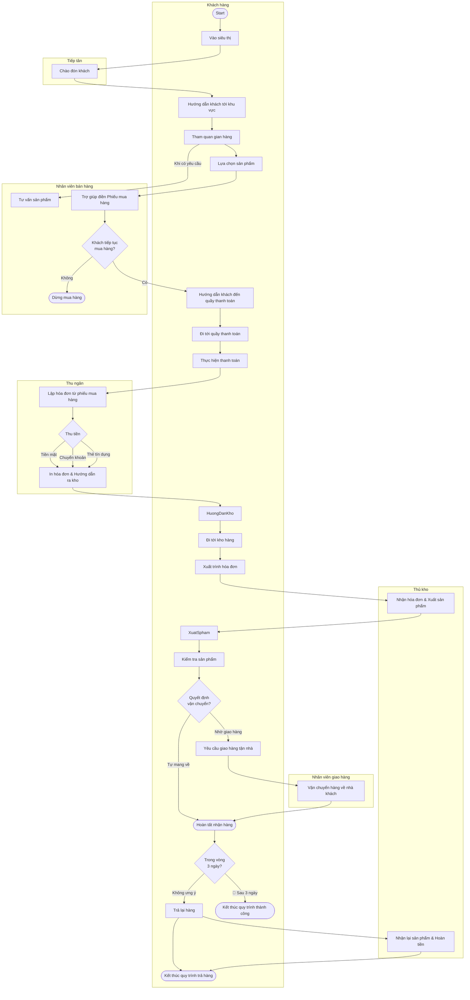
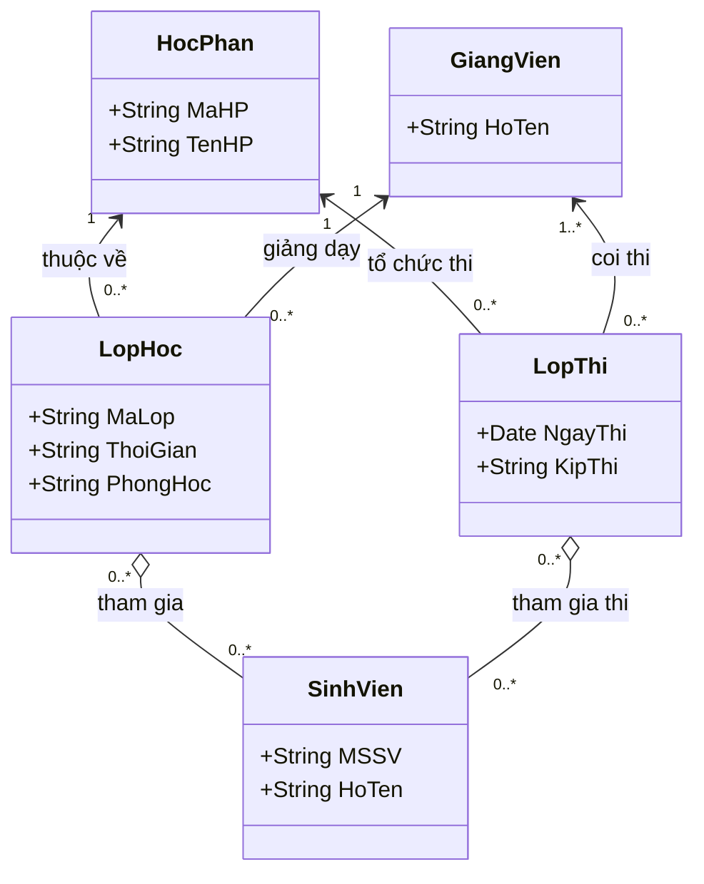
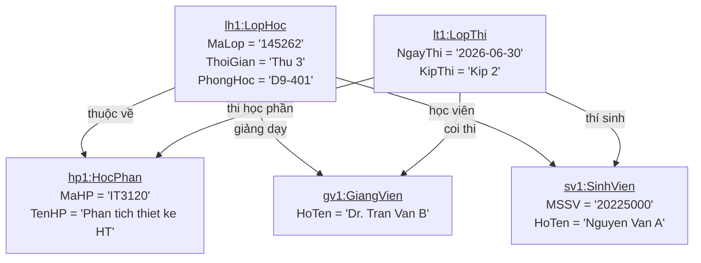
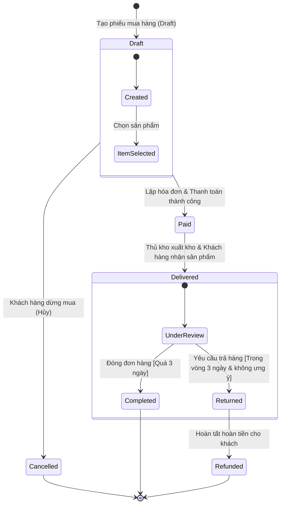

# CÁC CÂU HỎI ÔN THI CUỐI KỲ HAY - PHÂN TÍCH VÀ THIẾT KẾ HỆ THỐNG (IT3120)

Tài liệu này tổng hợp đầy đủ 81 câu hỏi (bao gồm trắc nghiệm và tự luận) từ đề thi ôn tập cuối kỳ Phân tích và Thiết kế Hệ thống (IT3120 - P2), kèm đáp án chuẩn xác và giải thích chi tiết dựa trên giáo trình chuẩn của Dennis, Wixom, Tegarden.

---

## 📌 DANH SÁCH CÂU HỎI VÀ ĐÁP ÁN CHI TIẾT

### Câu 1: Lựa chọn phương pháp phát triển trong điều kiện hệ thống phức tạp
*   **Đề bài:** Trong số các phương pháp phát triển hệ thống được liệt kê phương pháp nào được cho là lựa chọn tốt nhất trong điều kiện hệ thống phức tạp?
*   **Các lựa chọn:**
    *   Nguyên mẫu thiết kế (Throwaway Prototyping)
    *   Thác nước (Waterfall)
    *   SCRUM
    *   Nguyên mẫu hệ thống (System Prototyping)
*   **Đáp án đúng:** **Nguyên mẫu thiết kế (Throwaway Prototyping)** *(Đề bài ghi typo là "Nguyễn mẫu thiết kế")*
*   **Giải thích:** 
    Theo bảng tiêu chí lựa chọn phương pháp phát triển hệ thống (Dennis & Wixom):
    *   **Nguyên mẫu thiết kế (Throwaway Prototyping)** sử dụng các nguyên mẫu để làm rõ yêu cầu hoặc giải quyết các vấn đề kỹ thuật khó, sau đó vứt bỏ nguyên mẫu và tiến hành phân tích, thiết kế hệ thống thật một cách bài bản. Phương pháp này được đánh giá mức **Excellent** (Tuyệt vời) để xử lý các hệ thống có độ phức tạp cao (**System Complexity**).
    *   Nguyên mẫu hệ thống (System Prototyping) thường bỏ qua các bước phân tích sâu để nhanh chóng ra code, nên rất tệ (**Poor**) khi gặp hệ thống phức tạp.
    *   Thác nước (Waterfall) gặp nhiều rủi ro vì không cho người dùng tương tác sớm để sửa lỗi thiết kế.

---

### Câu 2: Các khung nhìn kiến trúc hệ thống
*   **Đề bài:** Mục nào không phải là 1 khung nhìn kiến trúc hệ thống?
*   **Các lựa chọn:**
    *   Khung nhìn chức năng (Functional / Use-case View)
    *   Khung nhìn cấu trúc (Logical / Structural View)
    *   Khung nhìn biểu đồ (Diagram View)
    *   Khung nhìn hành vi (Process / Behavioral View)
*   **Đáp án đúng:** **Khung nhìn biểu đồ (Diagram View)**
*   **Giải thích:** 
    Kiến trúc phần mềm chuẩn (như mô hình 4+1 View) gồm: Khung nhìn logic/cấu trúc (Logical), Khung nhìn tiến trình/hành vi (Process), Khung nhìn triển khai (Deployment/Physical), Khung nhìn thực hiện (Implementation/Development), và Khung nhìn ca sử dụng/chức năng (Use Case/Functional). "Biểu đồ" chỉ là công cụ thể hiện khung nhìn, không phải là một khung nhìn kiến trúc.

---

### Câu 3: Phân loại mô hình đặc tả ca sử dụng
*   **Đề bài:** Đặc tả chi tiết ca sử dụng có thể được xếp vào nhóm mô hình nào?
*   **Các lựa chọn:**
    *   Hình vẽ (Graphical models)
    *   Toán học (Mathematical models)
    *   Văn bản (Textual models)
    *   Các đáp án khác không đúng
*   **Đáp án đúng:** **Văn bản (Textual models)**
*   **Giải thích:** 
    Đặc tả chi tiết ca sử dụng (Use Case Specification) là một văn bản mô tả cấu trúc gồm: Tên ca sử dụng, Tác nhân, Tiền điều kiện, Luồng sự kiện chính, Luồng sự kiện phụ/thay thế, Hậu điều kiện... Vì vậy nó thuộc nhóm mô hình văn bản.

---

### Câu 4 (TỰ LUẬN): Vẽ biểu đồ triển khai (Deployment Diagram) cho hệ thống siêu thị
*   **Đề bài:** Giả sử hệ thống được xây dựng với các thành phần chính:
    *   Phân hệ bán hàng phục vụ cho nhân viên bán hàng cung cấp thông tin và tư vấn cho khách hàng.
    *   Phân hệ thanh toán phục vụ cho nhân viên thu ngân thanh toán và viết hóa đơn cho khách hàng.
    *   Phân hệ quản lý kho phục vụ cho nhân viên thủ kho thực hiện giao hàng cho các hóa đơn đã thanh toán.
    *   Phân hệ quản lý giao hàng phục vụ cho nhân viên giao hàng vận chuyển các đơn hàng.
    *   Phân hệ quản lý siêu thị phục vụ cho người quản lý siêu thị theo dõi tình hình kinh doanh của siêu thị.
    *   Hệ thống dịch vụ nghiệp vụ và cơ sở dữ liệu trung tâm cung cấp tất cả dịch vụ nghiệp vụ cho các phân hệ nói trên.
    Hãy tưởng tượng và vẽ một biểu đồ triển khai (deployment diagram) cho hệ thống như mô tả.
*   **Hướng dẫn thiết kế & Sơ đồ:**

```mermaid
deploymentDiagram
    node "POS Terminal (Sales)" as salesNode {
        artifact "SalesApp.exe" as salesApp
    }

    node "Cashier Terminal (Payment)" as paymentNode {
        artifact "PaymentApp.exe" as paymentApp
    }

    node "Warehouse PC" as warehouseNode {
        artifact "WarehouseApp.exe" as warehouseApp
    }

    node "Delivery Mobile Device" as deliveryNode {
        artifact "DeliveryApp.apk" as deliveryApp
    }

    node "Manager PC" as managerNode {
        artifact "ManagerDashboard.exe" as managerApp
    }

    node "Application Server" as appServer {
        artifact "BusinessServices.jar" as bizServices
    }

    node "Database Server" as dbServer {
        database "Central DB (RDBMS)" as centralDb
    }

    salesNode -- appServer : "HTTPS (REST API)"
    paymentNode -- appServer : "HTTPS (REST API)"
    warehouseNode -- appServer : "HTTPS (REST API)"
    deliveryNode -- appServer : "HTTPS/WSS"
    managerNode -- appServer : "HTTPS"
    appServer -- dbServer : "TCP/IP (JDBC - Port 5432)"
```

*   **Mô tả chi tiết các thành phần:**
    1.  **Thiết bị client (Nodes):**
        *   `POS Terminal (Sales)`: Máy tính tại quầy bán hàng chạy client `SalesApp`.
        *   `Cashier Terminal`: Máy thu ngân kết nối máy in hóa đơn chạy `PaymentApp`.
        *   `Warehouse PC`: Máy tính tại kho chạy `WarehouseApp` để cập nhật trạng thái xuất kho.
        *   `Delivery Mobile Device`: Thiết bị di động của nhân viên giao hàng chạy ứng dụng di động `DeliveryApp`.
        *   `Manager PC`: Máy tính của quản lý chạy Dashboard theo dõi.
    2.  **Máy chủ trung tâm (Servers):**
        *   `Application Server`: Nơi deploy dịch vụ nghiệp vụ tập trung (`BusinessServices`), kết nối và phục vụ yêu cầu từ 5 phân hệ client qua giao thức HTTPS.
        *   `Database Server`: Nơi lưu trữ cơ sở dữ liệu trung tâm (`Central DB`). Chỉ cho phép kết nối nội bộ từ `Application Server` qua giao thức JDBC/ODBC.

---

### Câu 5: Mẫu hành vi Visitor cho cấu trúc phòng ban
*   **Đề bài:** Một hệ thống quản lý cấu trúc các phòng ban trong một tổng công ty đã có các lớp thực thi ổn định. Nhóm phát triển muốn bổ sung thêm các tính năng phân tích dữ liệu khác nhau trên cấu trúc này (ví dụ: tính tổng lương, đánh giá hiệu suất, hoặc trích xuất báo cáo nhân sự) mà không muốn sửa đổi mã nguồn của các lớp phòng ban mỗi khi có yêu cầu phân tích mới. Họ nên sử dụng mẫu hành vi nào?
*   **Các lựa chọn:** Iterator, Template Method, Observer, Chain of Responsibility, Strategy, Mediator, Command, Visitor, Memento, Interpreter, State.
*   **Đáp án đúng:** **Khách thăm (Visitor)**
*   **Giải thích:** 
    Mẫu thiết kế **Visitor** cho phép định nghĩa các thao tác mới trên một cấu trúc đối tượng sẵn có (như cấu trúc hình cây của các phòng ban) mà không cần phải thay đổi mã nguồn của các lớp trong cấu trúc đó. Nó tách biệt cấu trúc dữ liệu khỏi thuật toán xử lý dữ liệu.

---

### Câu 6: Phân loại yêu cầu phi chức năng (Hiệu năng)
*   **Đề bài:** Yêu cầu "Hệ thống có thể đáp ứng 1000 yêu cầu ghi dữ liệu / s" thuộc nhóm yêu cầu nào?
*   **Các lựa chọn:**
    *   Yêu cầu hiệu năng (Performance Requirements)
    *   Yêu cầu chức năng (Functional Requirements)
    *   Yêu cầu bảo mật (Security Requirements)
    *   Yêu cầu vận hành (Operational Requirements)
*   **Đáp án đúng:** **Yêu cầu hiệu năng (Performance Requirements)**
*   **Giải thích:** 
    Yêu cầu về thông lượng (throughput - số lượng yêu cầu xử lý trong 1 giây) và thời gian phản hồi (response time) là các chỉ số đo lường hiệu năng vận hành của phần mềm, thuộc nhóm yêu cầu phi chức năng về hiệu năng.

---

### Câu 7: Ý nghĩa đường đứt nét thẳng đứng trong sơ đồ tuần tự
*   **Đề bài:** Trong sơ đồ tuần tự đường kẻ đứt nét thẳng đứng gắn với đối tượng biểu diễn thông tin gì?
*   **Các lựa chọn:**
    *   Trục thời gian, thời gian sống (Lifeline)
    *   Trang trí cho đẹp, không có chức năng gì
    *   Liên kết với các đối tượng khác
    *   Liên kết với hệ thống
*   **Đáp án đúng:** **Trục thời gian, thời gian sống (Lifeline)**
*   **Giải thích:** 
    Đường đứt nét thẳng đứng biểu diễn đường đời (Lifeline) hay trục thời gian sống của một đối tượng trong kịch bản tương tác, thời gian chạy từ trên xuống dưới.

---

### Câu 8: Phương pháp đánh giá giao diện Heuristic Evaluation
*   **Đề bài:** Phương pháp đánh giá giao diện 'Theo kinh nghiệm' (Heuristic Evaluation) dựa trên cơ sở đánh giá nào?
*   **Các lựa chọn:**
    *   Đối chiếu thiết kế với các quy tắc và nguyên lý
    *   Quan sát người dùng thử nghiệm trong phòng lab
    *   Dựa trên số lần nhấp chuột trung bình đo được
    *   Thảo luận trực tiếp với người dùng qua bản vẽ
*   **Đáp án đúng:** **Đối chiếu thiết kế với các quy tắc và nguyên lý**
*   **Giải thích:** 
    Đánh giá Heuristic là phương pháp kiểm định tính tiện dụng (usability inspection) bằng cách đối chiếu giao diện phần mềm với các nguyên lý thiết kế tương tác đã được thừa nhận rộng rãi (ví dụ: 10 nguyên lý của Jakob Nielsen).

---

### Câu 9: Lựa chọn phương pháp phát triển hệ thống tin cậy cao
*   **Đề bài:** Trong số các phương pháp phát triển hệ thống được liệt kê phương pháp nào được cho là lựa chọn tốt nhất trong điều kiện hệ thống tin cậy?
*   **Các lựa chọn:**
    *   Thác nước (Waterfall)
    *   Nguyên mẫu hệ thống (System Prototyping)
    *   XP (Extreme Programming)
    *   Chia pha (Phased Development)
*   **Đáp án đúng:** **XP** hoặc **Thác nước** (Tùy theo tài liệu/nhận định đề thi)
*   **Giải thích dựa trên Dennis & Wixom:**
    *   Nếu trong bảng lựa chọn có **Nguyên mẫu thiết kế (Throwaway Prototyping)**, đó là lựa chọn **Excellent** cho độ tin cậy hệ thống (**System Reliability**).
    *   Khi không có "Nguyên mẫu thiết kế", bảng so sánh đánh giá:
        *   **XP (Agile)**: Được đánh giá cao (**Excellent** hoặc **Good** tùy phiên bản giáo trình) nhờ cơ chế kiểm thử liên tục (TDD, Unit Test tự động) và tích hợp liên tục.
        *   **Thác nước (Waterfall)**: Được đánh giá **Good** vì có quy trình đặc tả tài liệu rõ ràng, dễ theo dõi và kiểm soát chất lượng từ đầu.
        *   **Chia pha (Phased)**: Được đánh giá **Good**.
        *   **Nguyên mẫu hệ thống (System Prototyping)**: Được đánh giá **Poor** (Kém) vì các nguyên mẫu xây dựng nhanh thường bỏ qua kiểm thử sâu và thiết kế kiến trúc chuẩn.

---

### Câu 10: Minh họa mức ghép nối Biểu diễn (Content/Representation Coupling)
*   **Đề bài:** Cho đoạn mã:
    ```java
    class Account { public double balance = 1000.0; }  
    class Hacker {     
        public void stealMoney(Account acc) { acc.balance = 0.0; } 
    }
    ```
    Đoạn code trên minh họa mức ghép nối tương tác nào?
*   **Các lựa chọn:** Biểu diễn, Không có ghép nối trực tiếp, Chung, Điều khiển.
*   **Đáp án đúng:** **Biểu diễn (Nội dung/Representation Coupling)**
*   **Giải thích:** 
    Lớp `Hacker` truy cập và chỉnh sửa trực tiếp thuộc tính dữ liệu công khai (`balance`) của lớp `Account` mà không qua bất kỳ phương thức đóng gói nào. Đây là mức ghép nối tồi tệ nhất, vi phạm tính đóng gói.

---

### Câu 11: Mẫu thiết kế Observer cho ứng dụng chứng khoán
*   **Đề bài:** Trong một ứng dụng chứng khoán, khi giá của một mã cổ phiếu thay đổi, hệ thống cần tự động cập nhật thông tin này lên tất cả các bảng bảng giá của người dùng và gửi thông báo về điện thoại. Mẫu thiết kế nào định nghĩa mối quan hệ này?
*   **Các lựa chọn:** Chuỗi trách nhiệm, Khách thăm, Lệnh, Bản sao lưu, Phương thức mẫu, Biến duyệt, Người quan sát, Lớp diễn dịch, Người trung gian, Chiến lược, Trạng thái.
*   **Đáp án đúng:** **Người quan sát (Observer)**
*   **Giải thích:** 
    Mẫu **Observer** định nghĩa mối quan hệ phụ thuộc một-nhiều giữa các đối tượng sao cho khi một đối tượng (mã cổ phiếu) thay đổi trạng thái, tất cả các đối tượng phụ thuộc (bảng giá, dịch vụ thông báo điện thoại) sẽ được tự động thông báo và cập nhật.

---

### Câu 12: Đặc trưng của OOAD vs Phân tích có cấu trúc
*   **Đề bài:** Mục nào không phải 1 đặc trưng của phân tích và thiết kế hướng đối tượng?
*   **Các lựa chọn:**
    1.  Biểu diễn hệ thống như một tập các đối tượng tương tác dựa trên thông điệp.
    2.  Phát triển hệ thống theo nguyên tắc lặp và tăng dần.
    3.  Phân rã hệ thống thành các mô-đun và cứ tiếp tục phân rã các mô-đun thành các mô-đun nhỏ hơn cho tới khi thu được các chức năng đủ nhỏ và cụ thể.
    4.  Biểu diễn các mục đích sử dụng và các giá trị nghiệp vụ tương ứng bằng các ca sử dụng.
*   **Đáp án đúng:** **Phân rã hệ thống thành các mô-đun và cứ tiếp tục phân rã các mô-đun thành các mô-đun nhỏ hơn...**
*   **Giải thích:** 
    Hành vi phân rã từ trên xuống dưới (Top-down decomposition / Functional Decomposition) để chia nhỏ chức năng cho đến khi thu được hàm nhỏ là đặc trưng tiêu biểu của **Phương pháp phân tích có cấu trúc truyền thống (Structured Analysis & Design)**, hoàn toàn ngược với tư duy hướng đối tượng (OOAD) dựa trên sự tương tác giữa các thực thể tự quản.

---

### Câu 13: Vị trí của hoạt động Mô hình hóa chức năng trong SDLC
*   **Đề bài:** Mô hình hóa chức năng là hoạt động tiêu biểu trong pha nào trong SDLC?
*   **Các lựa chọn:** Thực thi, Lập kế hoạch, Phân tích, Thiết kế.
*   **Đáp án đúng:** **Phân tích (Analysis)**
*   **Giải thích:** 
    Mô hình hóa chức năng (Functional Modeling) bao gồm việc vẽ sơ đồ ca sử dụng (Use Case Diagram), viết tài liệu đặc tả ca sử dụng, vẽ sơ đồ hoạt động (Activity Diagram)... Đây là hoạt động trọng tâm ở pha Phân tích để nắm bắt yêu cầu hệ thống.

---

### Câu 14: Phân loại ca sử dụng trong giai đoạn phân tích
*   **Đề bài:** Ca sử dụng thuộc các phân loại nào thường được xác định và đặc tả trong giai đoạn phân tích?
*   **Các lựa chọn:**
    *   Thực tế, Khái quát (Real, Summary)
    *   Thiết yếu, Chi tiết (Essential, Detailed)
    *   Thiết yếu, Khái quát (Essential, Summary)
    *   Thực tế, Chi tiết (Real, Detailed)
*   **Đáp án đúng:** **Thiết yếu, Chi tiết (Essential, Detailed)**
*   **Giải thích:** 
    *   **Essential (Thiết yếu):** Tập trung vào luồng nghiệp vụ thuần túy mà không bị ràng buộc bởi công nghệ hay thiết kế UI.
    *   **Detailed (Chi tiết):** Được đặc tả đầy đủ luồng sự kiện chính và luồng thay thế để đội ngũ phát triển hiểu rõ hệ thống.
    Cả hai thuộc tính này đều được hoàn thiện trong giai đoạn Phân tích. (Real/Thực tế dùng trong pha Thiết kế).

---

### Câu 15: Mối quan hệ giữa Component và Artifact trong Deployment Diagram
*   **Đề bài:** Loại quan hệ giữa component Order và artifact Order.jar trong sơ đồ triển khai là gì?
*   **Các lựa chọn:** deploy, manifest, extend, export.
*   **Đáp án đúng:** **manifest**
*   **Giải thích:** 
    Trong UML, mối quan hệ `<<manifest>>` thể hiện một artifact vật lý (ví dụ: file `Order.jar` hoặc `Order.war`) hiện thực hóa/chứa một thành phần logic (Component `Order`).

---

### Câu 16: Phân loại yêu cầu phi chức năng FURPS
*   **Đề bài:** Khái niệm nào không phải là 1 loại yêu cầu trong phân loại FURPS?
*   **Các lựa chọn:** Vận hành, Chức năng, Thẩm mĩ, Hiệu Năng.
*   **Đáp án đúng:** **Vận hành (Operations / Operational)**
*   **Giải thích:** 
    FURPS là viết tắt của: **F**unctionality (Chức năng), **U**sability (Tính tiện dụng - chứa các thuộc tính thẩm mỹ/aesthetics), **R**eliability (Độ tin cậy), **P**erformance (Hiệu năng), và **S**upportability (Khả năng hỗ trợ). Yêu cầu "Vận hành" (Operational) là phân loại trong mô hình phân chia phi chức năng của Dennis Wixom, không phải là một nhánh chính của FURPS.

---

### Câu 17: Biểu thức OCL select trong Airport Object Diagram
*   **Đề bài:** Trong ngữ cảnh lớp Airport và sơ đồ đối tượng, hãy cho biết số lượng đối tượng được trả về cho biểu thức: `self.departingFlights->select(duration < 6)`
*   **Đáp án đúng:** **1**
*   **Giải thích:** 
    Đối tượng `a2:Airport` đóng vai trò là `self`. Qua liên kết `departingFlights`, `a2` kết nối với chuyến bay `f2` (duration = 5) và `f4` (duration = 6). Điều kiện lọc là `duration < 6`, chỉ có `f2` thỏa mãn. Do đó kết quả trả về là tập hợp chứa `{f2}` với số lượng phần tử là 1.

---

### Câu 18: Mẫu khởi tạo (Creational Pattern) đơn giản nhất
*   **Đề bài:** Mẫu tạo nào có nguyên lý đơn giản nhất?
*   **Các lựa chọn:** Nhà máy trừu tượng, Thợ xây, Nguyên mẫu, Lớp độc bản, Phương thức xưởng.
*   **Đáp án đúng:** **Lớp độc bản (Singleton)**
*   **Giải thích:** 
    **Singleton** chỉ yêu cầu che giấu hàm khởi tạo (private constructor) và cung cấp một phương thức tĩnh public duy nhất để trả về một thực thể duy nhất của lớp đó trong suốt vòng đời ứng dụng.

---

### Câu 19: Đặc trưng của Found Message và Lost Message trong UML Sequence Diagram
*   **Đề bài:** Hãy chọn nhận xét đúng về sơ đồ sau (sơ đồ chứa mũi tên từ/đến vòng tròn đen đặc đại diện cho Found/Lost Message):
*   **Các lựa chọn:**
    *   Không xác định được đối tượng gửi thông điệp (Đúng nếu là Found Message).
    *   Sơ đồ không tương thích với quy chuẩn UML (Sai).
    *   Không xác định được đối tượng tiếp nhận thông điệp (Đúng nếu là Lost Message).
    *   Các đáp án khác không đúng.
*   **Đáp án đúng:** 
    *   Nếu mũi tên hướng từ vòng tròn đen vào đối tượng: Chọn **Không xác định được đối tượng gửi thông điệp** (đây là Found Message).
    *   Nếu mũi tên hướng từ đối tượng ra vòng tròn đen: Chọn **Không xác định được đối tượng tiếp nhận thông điệp** (đây là Lost Message).
*   **Giải thích:** Cả hai loại thông điệp này đều hoàn toàn tương thích và hợp lệ theo quy chuẩn UML.

---

### Câu 20 (TỰ LUẬN): Vẽ sơ đồ hoạt động (Activity Diagram) cho quy trình bán hàng tại siêu thị điện máy
*   **Đề bài:** Quy trình bán hàng tại một siêu thị điện máy được mô tả:
    *   Khách hàng vào siêu thị, tiếp tân chào đón và hướng dẫn đến khu vực mua hàng.
    *   Khách hàng tham quan gian hàng. Nhân viên bán hàng tư vấn/cung cấp thông tin sản phẩm khi được yêu cầu.
    *   Khách hàng lựa chọn sản phẩm, nhân viên bán hàng hỗ trợ ghi phiếu mua hàng.
    *   Trước khi lập hóa đơn & thanh toán, khách hàng có thể dừng mua hàng (Hủy quy trình).
    *   Nếu mua tiếp, nhân viên hướng dẫn khách hàng đến quầy thanh toán cùng phiếu mua hàng.
    *   Thu ngân lập hóa đơn từ phiếu mua hàng. Thu ngân thu tiền (tiền mặt / chuyển khoản / thẻ tín dụng), in hóa đơn và hướng dẫn khách đến kho nhận hàng.
    *   Tại kho hàng, khách xuất trình hóa đơn để thủ kho xuất sản phẩm.
    *   Sau khi kiểm tra, khách hàng tự mang về hoặc nhờ nhân viên giao hàng vận chuyển về nhà.
    *   Sau khi nhận hàng, khách có quyền trả lại hàng trong vòng 3 ngày nếu không ưng ý.
*   **Sơ đồ hoạt động (UML Activity Diagram với Swimlanes):**

```mermaid
  opt 
```
*(Mô tả luồng hoạt động phân bổ theo làn bơi)*:



---

### Câu 21: Mức thống nhất phương thức (Method Cohesion) tốt nhất
*   **Đề bài:** Hãy chọn mức thống nhất được đánh giá tốt nhất đối với phương thức trong các mức sau:
*   **Các lựa chọn:** Lô-gic, Ngẫu nhiên, Tuần Tự, Chức năng.
*   **Đáp án đúng:** **Chức năng (Functional Cohesion)**
*   **Giải thích:** 
    Thống nhất chức năng (Functional Cohesion) là mức thống nhất cao nhất và tốt nhất của phương thức. Phương thức chỉ thực hiện duy nhất một hành vi cụ thể và rõ ràng (Ví dụ: `tinhDienTich()`).

---

### Câu 22: Mức thống nhất phương thức Cổ điển (Temporal Cohesion)
*   **Đề bài:** Cho đoạn mã:
    ```java
    public void khoiTaoHeThong() { 
        ketNoiDatabase(); 
        initGiaoDienDangNhap();
        resetBoNhoTam(); 
    }
    ```
    Đoạn mã nguồn trên minh họa cho mức thống nhất phương thức nào?
*   **Các lựa chọn:** Tiến trình, Cổ điển, Tuần tự, Giao tiếp.
*   **Đáp án đúng:** **Cổ điển (Temporal Cohesion - Thống nhất thời gian)**
*   **Giải thích:** 
    Các hành động (kết nối DB, mở màn hình đăng nhập, xóa cache) được gộp chung vào phương thức `khoiTaoHeThong` chỉ vì chúng cùng phải thực hiện tại **một thời điểm** (lúc bắt đầu khởi động hệ thống).

---

### Câu 23: Đặc trưng của Sơ đồ tuần tự mức hệ thống (SSD)
*   **Đề bài:** Chọn nhận xét đúng về sơ đồ tuần tự mức hệ thống?
*   **Các lựa chọn:**
    *   Ghi chép các hoạt động sử dụng hệ thống của tác nhân
    *   Ghi nhận các yêu cầu phi chức năng đối với hệ thống
    *   Qui định cách chia nhỏ hệ thống thành các mô-đun
    *   Cho biết các bảng của CSDL được sử dụng trong ca sử dụng
*   **Đáp án đúng:** **Ghi chép các hoạt động sử dụng hệ thống của tác nhân**
*   **Giải thích:** 
    Sơ đồ tuần tự mức hệ thống (System Sequence Diagram - SSD) biểu diễn hệ thống như một "hộp đen" và ghi nhận các thông điệp (sự kiện hệ thống) trao đổi qua lại giữa tác nhân bên ngoài (Actor) và hệ thống đó.

---

### Câu 24: Áp dụng nguyên lý Đảo ngược phụ thuộc (DIP) trong kiến trúc phân tầng
*   **Đề bài:** Trong kiến trúc phân tầng đã đề cập trong học phần, mối quan hệ giữa hai tầng nào là thể hiện của nguyên lý đảo ngược phụ thuộc? (Chọn 2 đáp án)
*   **Các lựa chọn:** Kiến trúc vật lý, Tương tác người - máy, Nền tảng, Lĩnh vực nghiệp vụ.
*   **Đáp án đúng:** **Lĩnh vực nghiệp vụ** và **Nền tảng**
*   **Giải thích:** 
    Theo nguyên lý DIP, tầng Lĩnh vực nghiệp vụ (Business Domain) không nên phụ thuộc vào tầng Nền tảng (Infrastructure/Database) để lưu trữ. Thay vào đó, Lĩnh vực nghiệp vụ định nghĩa các Interface (Repository) và tầng Nền tảng sẽ hiện thực hóa (implement) chúng. Sự đảo chiều phụ thuộc này xảy ra giữa hai tầng nghiệp vụ và nền tảng.

---

### Câu 25: Yếu tố làm tăng thời gian phát triển hệ thống theo phương pháp UCP
*   **Đề bài:** Theo phương pháp UCP điều nào làm tăng thời gian phát triển hệ thống?
*   **Các lựa chọn:**
    *   Tăng kinh nghiệm về hệ thống tương tự
    *   Tăng nhân sự bán thời gian
    *   Tăng động lực làm việc
    *   Giữ yêu cầu ổn định
*   **Đáp án đúng:** **Tăng nhân sự bán thời gian**
*   **Giải thích:** 
    Nhân sự bán thời gian (Part-time staff) làm tăng độ phức tạp về quản lý, giao tiếp và làm giảm năng suất trung bình của đội ngũ. Trong tính toán UCP, đây là một hệ số môi trường tiêu cực làm tăng lượng nỗ lực (đơn vị giờ/người) cần thiết.

---

### Câu 26: Trạng thái bắt đầu của Sơ đồ máy trạng thái
*   **Đề bài:** Ở thời điểm bắt đầu, đối tượng có trạng thái nào? (Dựa trên sơ đồ máy trạng thái cụ thể).
*   **Các lựa chọn:** A, C, B, Các đáp án còn lại không đúng.
*   **Cách giải quyết:** 
    Trạng thái khởi đầu luôn là trạng thái được trỏ tới bởi mũi tên đi ra từ nút bắt đầu (hình tròn đen đặc `●`). Nhìn trên sơ đồ đề bài để chọn lớp trạng thái tương ứng (A, B hoặc C).

---

### Câu 27: Mức ghép nối phương thức Dấu ấn (Stamp/Structure Coupling)
*   **Đề bài:** Trường hợp tương tác mà trong đó phương thức gọi truyền cho phương thức được gọi 1 đối tượng bao gồm nhiều thuộc tính, đồng thời phương thức được gọi sử dụng một phần các thuộc tính của tham số thuộc mức ghép nối nào trong các mức sau?
*   **Các lựa chọn:** Toàn cục, Dữ liệu, Dấu ấn, Nội dung.
*   **Đáp án đúng:** **Dấu ấn (Stamp Coupling)**
*   **Giải thích:** 
    Ghép nối dấu ấn xảy ra khi chúng ta truyền cả một cấu trúc dữ liệu hoặc đối tượng lớn làm tham số cho phương thức, nhưng phương thức đó chỉ sử dụng một vài thuộc tính bên trong đối tượng đó.

---

### Câu 28: Ánh xạ từ sơ đồ lớp UML sang mã nguồn Java
*   **Đề bài:** Đoạn mã nguồn sau đây được sinh ra từ sơ đồ nào ở trên?
    ```java
    public class Class1 {          
        public Class2 objClass2;
        public Class1 () {}
    }
    public class Class2 {
        public Class2() {}
    }
    ```
*   **Đáp án đúng:** Sơ đồ biểu diễn mối quan hệ **Liên kết một chiều (Unidirectional Association)** hướng từ `Class1` sang `Class2`.
*   **Giải thích:** 
    `Class1` chứa thuộc tính tham chiếu trực tiếp đến `Class2` (`objClass2`), trong khi `Class2` không có thuộc tính nào tham chiếu đến `Class1`. Trên sơ đồ lớp, mối quan hệ này được biểu diễn bằng đường nét liền từ Class1 đến Class2 với mũi tên nhọn ở đầu Class2.

---

### Câu 29: Sử dụng mẫu thiết kế Decorator cho trình soạn thảo văn bản
*   **Đề bài:** Một ứng dụng soạn thảo văn bản cần cung cấp khả năng thêm các tính năng như "thanh cuộn", "khung viền" hoặc "đổ bóng" cho một cửa sổ hiển thị một cách linh hoạt tại thời điểm thực thi (runtime) mà không muốn tạo ra quá nhiều lớp con bằng cách thừa kế. Mẫu thiết kế nào phù hợp nhất?
*   **Các lựa chọn:** Lớp chuyển, Cầu nối, Người trang trí, Hạng ruồi, Mặt tiền, Phức hợp, Lớp đại diện.
*   **Đáp án đúng:** **Người trang trí (Decorator)**
*   **Giải thích:** 
    Mẫu **Decorator** cho phép đính kèm thêm các trách nhiệm và tính năng mới cho đối tượng một cách động ở thời điểm thực thi (runtime) bằng cách bao bọc đối tượng đó, giúp tránh việc lạm dụng thừa kế tạo ra quá nhiều lớp con tĩnh.

---

### Câu 30: Đặc điểm quan hệ Hợp nhất (Package Merge) trong Sơ đồ gói
*   **Đề bài:** Chọn (các) phát biểu đúng về quan hệ hợp nhất trong sơ đồ gói:
*   **Lưu ý đáp án đúng:**
    *   Được ký hiệu là `<<merge>>` (Không phải `<<combine>>`).
    *   Nội dung của gói đích (Target) được hợp nhất vào nội dung của gói nguồn (Source) - đầu mũi tên xuất phát từ gói nguồn trỏ tới gói đích.
    *   Các phần tử trùng tên và cùng kiểu dữ liệu giữa hai gói sẽ được tự động hợp nhất làm một phần tử chung.

---

### Câu 31: Mẫu khởi tạo Factory Method
*   **Đề bài:** Cho đoạn mã:
    ```java
    interface Animal { void speak(); }
    class Dog implements Animal { public void speak(){ System.out.println("Woof!"); } } 
    abstract class AnimalFactory { public abstract Animal createAnimal(); } 
    class DogFactory extends AnimalFactory { public Animal createAnimal() { return new Dog(); } }
    ```
    Mã nguồn trên minh họa cho mẫu tạo nào?
*   **Các lựa chọn:** Thợ xây, Nhà máy trừu tượng, Độc bản, Nguyên mẫu, Phương thức xưởng.
*   **Đáp án đúng:** **Phương thức xưởng (Factory Method)**
*   **Giải thích:** 
    Lớp cha `AnimalFactory` trì hoãn việc khởi tạo đối tượng cụ thể cho các lớp con bằng cách định nghĩa phương thức trừu tượng `createAnimal()`. Lớp con `DogFactory` hiện thực hóa nó để trả về đối tượng `Dog`.

---

### Câu 32: Rủi ro cốt lõi của chiến lược "Mua gói phần mềm"
*   **Đề bài:** Mỗi chiến lược thiết kế đều đi kèm với những rủi ro đặc thù. Khi một tổ chức quyết định chọn chiến lược "Mua gói phần mềm", họ phải đối mặt với rủi ro cốt lõi nào dưới đây?
*   **Các lựa chọn:**
    *   Rủi ro phụ thuộc vào năng lực chuyên môn của ban CNTT nội bộ để vận hành.
    *   Rủi ro mất kiểm soát trong việc chia sẻ thông tin nghiệp vụ quan trọng và bảo mật.
    *   Rủi ro phải chấp nhận thay đổi quy trình nghiệp vụ hiện tại của tổ chức.
    *   Rủi ro không thể tạo ra các thành phần ghép nối để mở rộng hệ thống.
*   **Đáp án đúng:** **Rủi ro phải chấp nhận thay đổi quy trình nghiệp vụ hiện tại của tổ chức**
*   **Giải thích:** 
    Phần mềm đóng gói sẵn (COTS) được thiết kế theo quy trình nghiệp vụ chuẩn chung. Để sử dụng hiệu quả mà không phải tuỳ biến tốn kém, tổ chức buộc phải thay đổi các quy trình nghiệp vụ nội bộ hiện tại của mình cho khớp với quy trình của phần mềm.

---

### Câu 33: Mức thống nhất phương thức Giao tiếp (Communicational Cohesion)
*   **Đề bài:** Cho đoạn mã:
    ```java
    public void phanTichBangDiem(BangDiem bangDiem) {
        double gpaHocKy = tinhGpaHienTai(bangDiem);     
        double gpaTichLuy = tinhGpaTichLuy(bangDiem); 
        System.out.println("Kỳ này: " + gpaHocKy + ", Tích lũy: " + gpaTichLuy); 
    }
    ```
    Đoạn mã nguồn trên minh họa cho mức thống nhất phương thức nào?
*   **Các lựa chọn:** Giao tiếp, Tuần tự, Cổ điển, Tiến trình.
*   **Đáp án đúng:** **Giao tiếp (Communicational Cohesion)**
*   **Giải thích:** 
    Các thao tác bên trong phương thức (`tinhGpaHienTai` và `tinhGpaTichLuy`) cùng thao tác và truy cập chung trên một nguồn dữ liệu đầu vào là đối tượng `bangDiem`.

---

### Câu 34: Thứ tự kết thúc các thông điệp trong biểu đồ giao tiếp
*   **Đề bài:** Sắp xếp thứ tự kết thúc các thông điệp m2, m3, m4, m5, m6 trong biểu đồ giao tiếp sau:
*   **Đáp án đúng:** **m4, m3, m5, m2, m6**
*   **Giải thích:** 
    Trong sơ đồ giao tiếp (Communication Diagram), thứ tự kết thúc của các thông điệp dựa trên hệ thống phân cấp đánh số (ví dụ: thông điệp con `1.1` phải kết thúc trước khi thông điệp cha `1` hoàn tất). Dựa vào sơ đồ đề bài, thứ tự kết thúc chính xác là m4 -> m3 -> m5 -> m2 -> m6.

---

### Câu 35: Trạng thái tương tác giữa Modeless Window và Modal Window
*   **Đề bài:** Giả sử người dùng đang mở một bảng công cụ được mô hình hóa là <<Modeless>> trên màn hình. Trong quá trình làm việc, hệ thống phát hiện một lỗi quan trọng và tự động bật lên một thông báo được mô hình hóa là <<Modal>>. Trạng thái tương tác của người dùng lúc này sẽ như thế nào?
*   **Các lựa chọn:**
    *   Hệ thống sẽ buộc phải tự động đóng cửa sổ Modeless để giải phóng tài nguyên.
    *   Mọi thao tác trên bảng công cụ Modeless sẽ bị vô hiệu hóa cho đến khi đóng cửa sổ Modal.
    *   Cửa sổ Modal sẽ bị ẩn ra phía sau cửa sổ Modeless.
    *   Người dùng vẫn có thể tiếp tục thao tác trên bảng công cụ vì nó đã được thiết lập nới lỏng.
*   **Đáp án đúng:** **Mọi thao tác trên bảng công cụ Modeless sẽ bị vô hiệu hóa cho đến khi đóng cửa sổ Modal.**
*   **Giải thích:** 
    Một thành phần giao diện dạng Modal (Hộp thoại bắt buộc) sẽ chiếm toàn bộ quyền kiểm soát tương tác của người dùng. Người dùng không thể thực hiện bất kỳ thao tác nào lên các cửa sổ khác của ứng dụng (kể cả Modeless) cho đến khi hộp thoại Modal này được đóng lại.

---

### Câu 36 (TỰ LUẬN): Xây dựng biểu đồ lớp và biểu đồ đối tượng cho hệ thống trường học
*   **Đề bài:** Giả sử một hệ thống cần lưu thông tin về Sinh Viên, Giảng Viên, Học Phần, Lớp Học và Lớp Thi. Thông tin các lớp: `SinhVien(HoTen, MSSV)`, `GiangVien(HoTen)`, `HocPhan(MaHP, TenHP)`, `LopHoc(MaLop, ThoiGian, PhongHoc)`, `LopThi(NgayThi, KipThi)`.
    *   a) Liệt kê/mô tả bằng lời các mối quan hệ giữa các lớp.
    *   b) Tạo mô hình cấu trúc bằng biểu đồ lớp (Class Diagram) kèm cơ số (multiplicity).
    *   c) Vẽ một biểu đồ đối tượng (Object Diagram) cụ thể.
*   **Đáp án tham khảo:**

#### a) Mô tả các mối quan hệ bằng lời:
1.  **Lớp học & Học phần:** Mỗi `LopHoc` thuộc về duy nhất một `HocPhan`. Một `HocPhan` có thể mở nhiều `LopHoc` trong kỳ (Quan hệ liên kết: 1 - 0..*).
2.  **Lớp học & Giảng viên:** Mỗi `LopHoc` được giảng dạy bởi duy nhất một `GiangVien`. Một `GiangVien` có thể giảng dạy nhiều `LopHoc` (Quan hệ liên kết: 1 - 0..*).
3.  **Lớp học & Sinh viên:** Một `SinhVien` có thể đăng ký học nhiều `LopHoc`. Một `LopHoc` có thể có nhiều `SinhVien` theo học (Quan hệ liên kết nhiều-nhiều: * - *).
4.  **Lớp thi & Học phần:** Một `LopThi` được tổ chức cho một `HocPhan` cụ thể. Một `HocPhan` có thể có nhiều `LopThi` (nếu chia ca) (Quan hệ liên kết: 1 - 0..*).
5.  **Lớp thi & Sinh viên:** Mỗi `LopThi` chứa danh sách nhiều `SinhVien` tham gia thi (Quan hệ liên kết nhiều-nhiều: * - *).
6.  **Lớp thi & Giảng viên:** Mỗi `LopThi` được giám sát/coi thi bởi một hoặc nhiều `GiangVien` (Quan hệ liên kết: 1..* - 0..*).

#### b) Biểu đồ lớp (UML Class Diagram):



#### c) Biểu đồ đối tượng (UML Object Diagram):



---

### Câu 37: Đồng sinh về Quy ước (Connascence of Convention)
*   **Đề bài:** Xét ứng dụng quản lý điểm thi của sinh viên. Do hạn chế của hệ thống cũ, điểm số của sinh viên nếu chưa được chấm sẽ được lưu trữ dưới cơ sở dữ liệu với giá trị mặc định là -1. Tại lớp GiaoDienHienThi, phương thức InBangDiem() có đoạn mã kiểm tra: if (diemSo < 0) thì in ra màn hình chuỗi "Chưa có điểm". Một thời gian sau, cơ sở dữ liệu quy định lại, dùng giá trị -999 để đại diện cho trạng thái "chưa có điểm". Sự phụ thuộc logic này thuộc trường hợp đồng sinh nào?
*   **Các lựa chọn:** Đồng sinh về Quy ước, Đồng sinh về Kiểu hoặc Lớp, Đồng sinh về Vị trí, Đồng sinh về Giải thuật.
*   **Đáp án đúng:** **Đồng sinh về Quy ước (Connascence of Convention)**
*   **Giải thích:** 
    Đồng sinh về quy ước xảy ra khi nhiều thành phần trong hệ thống phải ngầm đồng ý sử dụng một quy ước giá trị cụ thể để đại diện cho một ý nghĩa logic (như dùng số `-1` hay `-999` đại diện cho "Chưa có điểm"). Khi quy ước này ở CSDL thay đổi, code giao diện cũng bắt buộc phải đổi theo.

---

### Câu 38: Thực thể không biểu diễn như một đối tượng trong OOAD
*   **Đề bài:** Trong mô hình hóa hướng đối tượng thứ gì không được biểu diễn như 1 đối tượng?
*   **Các lựa chọn:** Thông điệp, Cơ sở dữ liệu, Tác nhân, Hệ thống.
*   **Đáp án đúng:** **Tác nhân (Actor)** hoặc **Cơ sở dữ liệu (Database)** (Tùy ngữ cảnh câu hỏi).
*   **Giải thích:** 
    *   **Tác nhân (Actor):** Đại diện cho các thực thể bên ngoài hệ thống tương tác với phần mềm, vì nằm ngoài biên hệ thống nên chúng không được thiết kế hay khởi tạo thành các đối tượng chương trình chạy bên trong hệ thống.
    *   **Cơ sở dữ liệu (Database):** Trong pha phân tích thiết kế logic, CSDL là một hệ thống lưu trữ ngoài, chúng ta chỉ mô tả các lớp thực thể (Entity Class) ánh xạ vào bảng CSDL, chứ bản thân DBMS không được biểu diễn thành một đối tượng nghiệp vụ.

---

### Câu 39: Ký hiệu rẽ nhánh song song trong Sơ đồ hoạt động
*   **Đề bài:** Trong biểu đồ hoạt động, nút nào được sử dụng để biểu diễn rẽ nhánh song song?
*   **Các lựa chọn:** Tùy chọn 3, Tùy chọn 2, Tùy chọn 1, Tùy chọn 4.
*   **Đáp án đúng:** Chọn tùy chọn biểu diễn **Thanh phân nhánh (Fork Node)**.
*   **Giải thích:** 
    *   **Fork Node (Thanh phân nhánh):** Biểu diễn bằng một **thanh ngang/dọc màu đen đặc** để tách một luồng hoạt động thành nhiều luồng chạy song song.
    *   **Decision Node (Nút quyết định):** Hình thoi dùng cho rẽ nhánh có điều kiện loại trừ lẫn nhau (chỉ một nhánh được chạy).

---

### Câu 40: Lựa chọn phương pháp phát triển khi công nghệ chưa quen thuộc (Unfamiliar Technology)
*   **Đề bài:** Trong số các phương pháp phát triển hệ thống được liệt kê phương pháp nào được cho là lựa chọn tốt nhất trong điều kiện Công nghệ mới?
*   **Các lựa chọn:** Nguyên mẫu hệ thống, Nguyên mẫu thiết kế, SCRUM, XP.
*   **Đáp án đúng:** **Nguyên mẫu thiết kế (Throwaway Prototyping)**
*   **Giải thích:** 
    Khi công nghệ mới hoặc chưa quen thuộc với đội ngũ phát triển (**Unfamiliar Technology**), phương pháp **Nguyên mẫu thiết kế (Throwaway Prototyping)** là tốt nhất (**Excellent**). Nó cho phép lập trình viên tạo các bản thử nghiệm nhanh để nghiên cứu sâu tính khả thi và làm chủ công nghệ trước khi chính thức thiết kế hệ thống chính thức.

---

### Câu 41: Vi phạm nguyên lý Liskov Substitution Principle (LSP)
*   **Đề bài:** Cho đoạn mã:
    ```python
    class Bird:     
        def fly(self): print("Đang bay...")  
    class Penguin(Bird):     
        def fly(self): raise NotImplementedError("Chim cánh cụt không biết bay!")
    ```
    Đoạn mã nguồn trên minh họa cho việc vi phạm nguyên lí nào của SOLID?
*   **Các lựa chọn:** ISP, OCP, DIP, LSP, SRP.
*   **Đáp án đúng:** **Liskov Substitution Principle (LSP - Nguyên lý thay thế Liskov)**
*   **Giải thích:** 
    LSP yêu cầu các đối tượng của lớp con (`Penguin`) phải có khả năng thay thế hoàn toàn cho đối tượng của lớp cha (`Bird`) mà không làm thay đổi hay phá vỡ tính đúng đắn của chương trình. Việc `Penguin` kế thừa `Bird` nhưng ném ra ngoại lệ khi gọi hàm `fly()` đã phá vỡ hành vi kỳ vọng của lớp cha, vi phạm LSP.

---

### Câu 42: Đọc cơ số (Multiplicity) trong Sơ đồ lớp UML
*   **Đề bài:** Một đối tượng Foobar... (Dựa trên sơ đồ lớp UML biểu diễn mối quan hệ giữa Foobar và Barfoo).
*   **Các lựa chọn:**
    *   Có thể không có quan hệ với đối tượng Barfoo nào (Nếu cơ số phía Barfoo có dạng `0..1` hoặc `*` / `0..*`).
    *   Có quan hệ với chỉ 1 đối tượng Barfoo (Nếu cơ số phía Barfoo là `1`).
    *   Có quan hệ với 1 hoặc nhiều hơn 1 đối tượng Barfoo (Nếu cơ số phía Barfoo là `1..*`).
*   **Cách giải quyết:** Đọc chữ số ở đầu đường nối bên phía đối tượng `Barfoo`:
    *   `1..*` -> Chọn "Có quan hệ với 1 hoặc nhiều hơn 1 đối tượng Barfoo".
    *   `0..1` -> Chọn "Có thể không có quan hệ với đối tượng Barfoo nào".

---

### Câu 43: Nối mẫu thiết kế hành vi (Behavioral Patterns) với tác dụng chính
*   **Đề bài:** Nối mẫu thiết kế hành vi với tác dụng chính.
*   **Đáp án đúng:** **1C 2F 3I 4E 5K 6G 7A 8J 9B 10D 11H**
*   **Bảng ánh xạ tương ứng:**
    1.  **Chuỗi trách nhiệm (Chain of Responsibility)** $\rightarrow$ **C**: Chuyển tiếp yêu cầu dọc theo danh sách các đối tượng xử lý.
    2.  **Lệnh (Command)** $\rightarrow$ **F**: Vật thể hóa các yêu cầu/hành động thành một đối tượng độc lập.
    3.  **Thông dịch (Interpreter)** $\rightarrow$ **I**: Giải quyết các vấn đề liên quan đến ngôn ngữ/ngữ pháp.
    4.  **Bộ lặp (Iterator)** $\rightarrow$ **E**: Duyệt qua các phần tử của tập hợp mà không làm lộ cấu trúc lưu trữ nội bộ.
    5.  **Người trung gian (Mediator)** $\rightarrow$ **K**: Điều phối giao tiếp phức tạp giữa các đối tượng.
    6.  **Vật lưu niệm (Memento)** $\rightarrow$ **G**: Lưu trữ và hoàn tác (restore) trạng thái nội bộ của đối tượng mà không vi phạm tính đóng gói.
    7.  **Người quan sát (Observer)** $\rightarrow$ **A**: Phát tán sự kiện và đồng bộ thay đổi trạng thái tự động giữa các đối tượng phụ thuộc.
    8.  **Trạng thái (State)** $\rightarrow$ **J**: Thay đổi cách phản ứng/hành vi của đối tượng theo điều kiện/trạng thái nội tại.
    9.  **Chiến lược (Strategy)** $\rightarrow$ **B**: Linh hoạt hoán đổi các thuật toán khác nhau tại thời điểm chạy.
    10. **Phương thức khuôn mẫu (Template Method)** $\rightarrow$ **D**: Xây dựng khung xương cho thuật toán ở lớp cha, cho phép lớp con định nghĩa chi tiết một số bước.
    11. **Khách thăm (Visitor)** $\rightarrow$ **H**: Thêm thao tác mới vào cấu trúc lớp sẵn có mà không sửa đổi mã nguồn của chúng.

---

### Câu 44: Lựa chọn chiến lược thiết kế cho nghiệp vụ không cốt lõi
*   **Đề bài:** Khi nhu cầu nghiệp vụ không phải cốt lõi, nên sử dụng chiến lược thiết kế nào?
*   **Các lựa chọn:** Tích hợp hệ thống, Sử dụng gói phần mềm, Gia công phần mềm, Phát triển riêng.
*   **Đáp án đúng:** **Sử dụng gói phần mềm (Packaged Software)** hoặc **Gia công phần mềm (Outsourcing)**.
*   **Giải thích:** 
    Khi nghiệp vụ không phải là năng lực cốt lõi của doanh nghiệp (ví dụ: phần mềm kế toán, quản lý nhân sự hành chính), doanh nghiệp không nên tự xây dựng (Phát triển riêng). Lựa chọn tối ưu là **Sử dụng gói phần mềm sẵn có** để tiết kiệm chi phí và thời gian, hoặc **Gia công phần mềm** nếu cần giải pháp chuyên biệt nhưng không muốn duy trì đội ngũ lập trình nội bộ.

---

### Câu 45: Bài toán The Square-Rectangle Problem và nguyên lý SOLID
*   **Đề bài:** Bài toán The Square-Rectangle Problem là ví dụ kinh điển cho sự vi phạm nguyên tắc nào?
*   **Các lựa chọn:** SRP, LSP, DIP, ISP, OCP.
*   **Đáp án đúng:** **LSP (Liskov Substitution Principle)**
*   **Giải thích:** 
    Việc xem Hình vuông là con của Hình chữ nhật trong lập trình hướng đối tượng dẫn đến việc thay đổi chiều rộng sẽ thay đổi cả chiều cao của hình vuông, điều này phá vỡ các quy tắc hình học của hình chữ nhật thông thường, minh họa sự vi phạm nguyên lý thay thế Liskov.

---

### Câu 46: Mục đích chính của việc phát triển hệ thống thông tin
*   **Đề bài:** Mục đích chính của phát triển một hệ thống thông tin là:
*   **Các lựa chọn:** Kiếm thêm lợi nhuận, Giảm chi phí, Giải quyết vấn đề của người dùng, Tiết kiệm năng lượng.
*   **Đáp án đúng:** **Giải quyết vấn đề của người dùng**
*   **Giải thích:** 
    Mọi hệ thống thông tin ra đời trước hết là để giải quyết các khó khăn, thách thức nghiệp vụ hoặc nhu cầu thực tế của người dùng cuối. Lợi nhuận hay giảm chi phí là hệ quả đi kèm.

---

### Câu 47: Điều kiện chống chỉ định áp dụng Mô hình Thác nước (Waterfall)
*   **Đề bài:** Trong điều kiện không xác định chính xác được các yêu cầu ngay từ đầu và có nhiều công nghệ mới thì không nên áp dụng mô hình quy trình nào?
*   **Các lựa chọn:** Mô hình thác nước, Mô hình phát triển linh hoạt, Mô hình phát triển chia pha, Mô hình nguyên mẫu thiết kế.
*   **Đáp án đúng:** **Mô hình thác nước (Waterfall)**
*   **Giải thích:** 
    Mô hình Thác nước đòi hỏi yêu cầu hệ thống phải cực kỳ rõ ràng, ổn định từ đầu và công nghệ phải quen thuộc. Nếu áp dụng khi yêu cầu mơ hồ và công nghệ mới, dự án sẽ chịu rủi ro rất cao do không thể thay đổi thiết kế ở giai đoạn muộn.

---

### Câu 48: Ý nghĩa ký hiệu [D] và [L] trong biểu đồ IFML/WebML
*   **Đề bài:** Giải thích hình vẽ chứa [D] và [L] trong phân vùng IFML:
*   **Đáp án đúng:** **`[D]` là phân vùng mặc định hiển thị khi vùng chứa nó được kích hoạt, và `[L]` là phân vùng đánh dấu (Landmark) cho phép người dùng điều hướng thẳng tới nó từ các phân vùng khác.**
*   **Giải thích:**
    *   `[D]` (Default): Chỉ định view mặc định được tải khi vùng chứa (Container/Area) chứa nó bắt đầu hiển thị.
    *   `[L]` (Landmark): Chỉ định một điểm mốc điều hướng, cho phép chuyển hướng nhanh đến vùng này từ bất kỳ đâu trong cùng một cấp mà không cần nối dây liên kết tường minh.

---

### Câu 49: Hạn chế lỗi nhập liệu khi thiết kế giao diện nhập
*   **Đề bài:** Chọn 1 biện pháp hiệu quả để hạn chế lỗi nhập liệu khi thiết kế giao diện nhập?
*   **Các lựa chọn:** Cung cấp các phím tắt, Kiểm tra dữ liệu nhập, chỉ tiếp nhận dữ liệu nhập thỏa mãn ràng buộc, Sử dụng mầu sắc rực rỡ, Cung cấp các hướng dẫn chi tiết.
*   **Đáp án đúng:** **Kiểm tra dữ liệu nhập, chỉ tiếp nhận dữ liệu nhập thỏa mãn ràng buộc**
*   **Giải thích:** 
    Kiểm tra dữ liệu nhập (Input Validation) bằng cách giới hạn định dạng nhập, đưa ra cảnh báo lỗi trực tiếp và chỉ cho phép gửi khi dữ liệu hợp lệ là biện pháp kỹ thuật triệt để nhất để loại bỏ dữ liệu sai từ nguồn.

---

### Câu 50: Mẫu hành vi quản lý trạng thái động của đối tượng
*   **Đề bài:** Một lớp Document trong hệ thống quản lý văn bản có các hành vi khác nhau (như edit(), publish()) tùy thuộc vào việc nó đang ở chế độ "Bản nháp", "Đang kiểm duyệt" hay "Đã xuất bản". Thay vì dùng quá nhiều câu lệnh if-else, bạn nên dùng mẫu nào để quản lý việc thay đổi hành vi này?
*   **Các lựa chọn:** Người trung gian, Trạng thái, Chiến lược, Lớp diễn dịch, Phương thức mẫu, Biến duyệt, Lệnh, Người quan sát, Khách thăm, Bản sao lưu, Chuỗi trách nhiệm.
*   **Đáp án đúng:** **Trạng thái (State)**
*   **Giải thích:** 
    Mẫu thiết kế **State** cho phép một đối tượng thay đổi hành vi của nó khi trạng thái nội bộ của nó thay đổi. Bằng cách đóng gói mỗi trạng thái trong một lớp riêng, ta loại bỏ các khối lệnh `if-else` phức tạp kiểm tra trạng thái trước khi thực hiện hành động.

---

### Câu 51: Ý nghĩa của nguyên lý Open/Closed Principle (OCP)
*   **Đề bài:** Cụm từ "Thêm mới thoải mái, cấm sửa code cũ" là để chỉ nguyên lí nào của SOLID?
*   **Các lựa chọn:** Open/Closed Principle, Dependency Inversion Principle, Single Responsibility Principle, Liskov Substitution Principle, Interface Segregation Principle.
*   **Đáp án đúng:** **Open/Closed Principle (OCP - Nguyên lý Đóng/Mở)**
*   **Giải thích:** 
    Nguyên lý OCP quy định: Một thành phần phần mềm nên mở rộng cho việc phát triển thêm tính năng mới (**Open for extension**) nhưng đóng lại trước việc sửa đổi mã nguồn cũ đang chạy ổn định (**Closed for modification**).

---

### Câu 52 (TỰ LUẬN): Vẽ biểu đồ máy trạng thái (State Machine Diagram) cho đối tượng Đơn hàng
*   **Đề bài:** (Từ quy trình bán hàng ở câu 20) Hãy vẽ biểu đồ máy trạng thái thể hiện các trạng thái và chuyển trạng thái của đối tượng đơn hàng.
*   **Sơ đồ máy trạng thái (UML State Machine Diagram):**



*   **Mô tả các trạng thái chính:**
    1.  `Draft` (Bản nháp/Phiếu mua hàng): Trạng thái đơn hàng đang được soạn thảo, chọn hàng.
    2.  `Cancelled` (Đã hủy): Trạng thái đơn hàng bị hủy bỏ khi khách dừng mua trước khi thanh toán.
    3.  `Paid` (Đã thanh toán): Đơn hàng đã được thu ngân lập hóa đơn và nhận tiền.
    4.  `Delivered` (Đã giao hàng): Sản phẩm đã xuất kho và giao cho khách.
    5.  `Returned` (Đã trả lại): Khách mang trả hàng trong vòng 3 ngày.
    6.  `Refunded` (Đã hoàn tiền): Tiền đã trả lại cho khách sau khi trả hàng.
    7.  `Completed` (Hoàn tất): Đơn hàng kết thúc thành công sau 3 ngày mà không phát sinh trả hàng.

---

### Câu 53: Sản phẩm đầu ra của pha Thiết kế (Design Phase)
*   **Đề bài:** Tài liệu đặc tả hệ thống là đầu ra của pha nào trong SDLC?
*   **Các lựa chọn:** Xây dựng, Thiết kế, Lập kế hoạch, Phân tích.
*   **Đáp án đúng:** **Thiết kế (Design)**
*   **Giải thích:** 
    *   Pha Phân tích tạo ra **Bản đề xuất hệ thống (System Proposal)**.
    *   Pha Thiết kế chuyển đổi các yêu cầu logic thành giải pháp kỹ thuật cụ thể và đóng gói thành **Tài liệu đặc tả hệ thống (System Specification)** làm đầu vào cho pha Xây dựng.

---

### Câu 54: Mâu thuẫn giữa tính mở rộng và tối ưu hóa tính toán
*   **Đề bài:** Mục tiêu thiết kế để dễ mở rộng và thay đổi hệ thống thường mâu thuẫn với mục tiêu nào sau đây?
*   **Các lựa chọn:**
    *   Tiết kiệm bộ nhớ, tối ưu hóa các xử lý tính toán.
    *   Duy trì tính ổn định và tương thích của các khái niệm trong các lớp trong cùng 1 cây kế thừa.
    *   Mỗi lớp biểu diễn đúng 1 thứ, không tích hợp nhiều vai trò trong 1 lớp.
    *   Thiết kế các lớp nhỏ chỉ có 1 lý do để thay đổi.
*   **Đáp án đúng:** **Tiết kiệm bộ nhớ, tối ưu hóa các xử lý tính toán**
*   **Giải thích:** 
    Để hệ thống dễ mở rộng, lập trình viên thường áp dụng các lớp trừu tượng (abstract), interface, và các mẫu thiết kế. Việc này tạo thêm các lớp trung gian, làm tăng chi phí gọi hàm và tiêu tốn nhiều bộ nhớ hơn, trực tiếp mâu thuẫn với mục tiêu tối ưu hiệu năng tính toán thô.

---

### Câu 55: Mẫu thiết kế Facade che giấu sự phức tạp hệ thống con
*   **Đề bài:** Hệ thống của bạn sử dụng một bộ thư viện bên thứ ba rất đồ sộ và phức tạp với hàng trăm lớp khác nhau. Để giúp người dùng dễ tiếp cận, bạn muốn cung cấp một giao diện đơn giản, chỉ chứa các phương thức quan trọng và hay dùng nhất để che giấu sự phức tạp bên trong. Bạn nên dùng mẫu nào?
*   **Các lựa chọn:** Lớp đại diện, Mặt tiền, Cầu nối, Phức hợp, Người trang trí, Lớp chuyển, Hạng ruồi.
*   **Đáp án đúng:** **Mặt tiền (Facade)**
*   **Giải thích:** 
    Mẫu **Facade** cung cấp một giao diện đơn giản hóa duy nhất cho một hệ thống con (subsystem) phức tạp giúp các client bên ngoài dễ tương tác hơn mà không cần biết chi tiết hoạt động của hàng trăm lớp bên trong.

---

### Câu 56: Đặc trưng cơ bản của OOSAD
*   **Đề bài:** Mục nào không phải là 1 đặc điểm cơ bản của OOSAD?
*   **Các lựa chọn:** Kiến trúc khung (Architecture-centric), Lặp và tăng dần (Iterative & Incremental), Dẫn dắt bởi ca sử dụng (Use-case driven), Dựa trên MVC.
*   **Đáp án đúng:** **Dựa trên MVC**
*   **Giải thích:** 
    Ba đặc trưng cốt lõi cấu thành OOSAD là: Dẫn dắt bởi ca sử dụng, lấy kiến trúc làm trung tâm, lặp và tăng trưởng dần. MVC chỉ là một mẫu kiến trúc phần mềm cụ thể cho giao diện, không phải là đặc trưng cơ bản của phương pháp luận OOSAD.

---

### Câu 57: Ký hiệu Cơ sở dữ liệu trong UML
*   **Đề bài:** Trong UML hình khối nào được sử dụng để biểu diễn CSDL?
*   **Đáp án đúng:** **Hình trụ (Cylinder)**
*   **Giải thích:** 
    Trong các biểu đồ triển khai hoặc biểu đồ thành phần UML, CSDL hoặc các bộ lưu trữ dữ liệu cố định (Data Store) luôn được ký hiệu dưới dạng một hình trụ tròn.

---

### Câu 58: Biểu diễn mối quan hệ Aggregation (Kết nhập) trong UML
*   **Đề bài:** Sơ đồ nào biểu diễn A là 1 bộ phận của B tuy nhiên B không sở hữu A?
*   **Đáp án đúng:** Sơ đồ mối quan hệ **Kết nhập (Aggregation)**.
*   **Giải thích:** 
    Quan hệ kết nhập (Aggregation) biểu diễn mối quan hệ toàn thể - bộ phận (Whole-Part) yếu, trong đó bộ phận A có thể tồn tại độc lập với toàn thể B. Ký hiệu là đường nét liền kết nối 2 lớp với **hình thoi rỗng** đặt ở phía lớp toàn thể (lớp B).

---

### Câu 59: Vai trò quản lý dự án trong chiến lược Gia công phần mềm
*   **Đề bài:** Nếu người quản lý dự án có khả năng "điều phối công việc của nhà cung cấp", chiến lược thiết kế nào đang được nhắc đến?
*   **Các lựa chọn:** Phát triển riêng, Sử dụng gói phần mềm, Gia công phần mềm, Tích hợp hệ thống.
*   **Đáp án đúng:** **Gia công phần mềm (Outsourcing)**
*   **Giải thích:** 
    Trong chiến lược Gia công phần mềm (Outsourcing), doanh nghiệp thuê một đối tác bên ngoài phát triển hệ thống. Do đó, vai trò chính của quản lý dự án phía doanh nghiệp là giám sát, nghiệm thu và điều phối tiến độ công việc của nhà cung cấp này.

---

### Câu 60: Biểu diễn mối quan hệ Whole-Part trong Sơ đồ lớp
*   **Đề bài:** Sơ đồ lớp nào biểu diễn A là 1 phần của B?
*   **Đáp án đúng:** Sơ đồ có **hình thoi (rỗng hoặc đặc) nằm ở phía lớp B**.
*   **Giải thích:** 
    Trong UML Class Diagram, hình thoi thể hiện mối quan hệ Whole-Part (Whole chứa Part) và hình thoi luôn luôn được gắn vào lớp đóng vai trò là "Whole" (lớp chứa - ở đây là B).

---

### Câu 61: Nối các mẫu khởi tạo (Creational Patterns) với tác dụng chính
*   **Đề bài:** Nối mẫu tạo với tác dụng chính.
*   **Đáp án đúng:** **1C 2D 3B 4E 5A**
*   **Bảng ánh xạ tương ứng:**
    1.  **Nhà máy trừu tượng (Abstract Factory)** $\rightarrow$ **C**: Đồng bộ hóa (Tạo ra các họ đối tượng liên quan và đảm bảo chúng tương thích/đồng bộ với nhau).
    2.  **Thợ xây (Builder)** $\rightarrow$ **D**: Xử lý các đối tượng phức tạp (Chia nhỏ quy trình xây dựng đối tượng thành từng bước độc lập).
    3.  **Phương thức xưởng (Factory Method)** $\rightarrow$ **B**: Nới lỏng tính phụ thuộc (Cho phép lớp con quyết định việc khởi tạo lớp cụ thể nào).
    4.  **Nguyên mẫu (Prototype)** $\rightarrow$ **E**: Tối ưu hóa chi phí (Tạo đối tượng mới bằng cách nhân bản/clone từ một đối tượng mẫu có sẵn để tránh chi phí khởi tạo đắt đỏ).
    5.  **Lớp độc bản (Singleton)** $\rightarrow$ **A**: Kiểm soát hệ thống (Đảm bảo chỉ có một instance duy nhất được truy cập toàn cục).

---

### Câu 62: Nhận diện thực thể không phải ca sử dụng (Use Case)
*   **Đề bài:** Trong một hệ thống bán hàng trực tuyến hoạt động nào không nên coi như 1 ca sử dụng?
*   **Các lựa chọn:**
    *   Tạo đơn hàng - Hỗ trợ khách hàng tạo đơn hàng.
    *   Tìm kiếm sản phẩm - Hỗ trợ khách hàng tìm kiếm sản phẩm.
    *   Nhập số lượng sản phẩm - cho phép khách hàng nhập số lượng muốn mua.
    *   Quản lý giỏ hàng - Hỗ trợ khách hàng lựa chọn sản phẩm, cho phép thêm, xóa, sửa.
*   **Đáp án đúng:** **Nhập số lượng sản phẩm**
*   **Giải thích:** 
    Một ca sử dụng phải mang lại một giá trị nghiệp vụ hoàn chỉnh và có ý nghĩa đối với Actor. Hành động "Nhập số lượng sản phẩm" chỉ là một bước thao tác UI nhỏ nằm trong ca sử dụng "Quản lý giỏ hàng" hoặc "Tạo đơn hàng", không thể đứng độc lập như một ca sử dụng.

---

### Câu 63: Vi phạm nguyên lý Single Responsibility Principle (SRP)
*   **Đề bài:** Cho đoạn mã:
    ```python
    class GpaManager:     
        def read_excel(self, file_path): 
            print(f"Đọc dữ liệu từ {file_path}") 
            return {"Toán": 3.5, "Lý": 4.0}              
        def calculate_gpa(self, data): 
            print("Tính toán điểm trung bình...")
    ```
    Đoạn mã nguồn trên minh họa cho việc vi phạm nguyên lí nào của SOLID?
*   **Các lựa chọn:** OCP, SRP, DIP, ISP, LSP.
*   **Đáp án đúng:** **Single Responsibility Principle (SRP - Nguyên lý đơn trách nhiệm)**
*   **Giải thích:** 
    Lớp `GpaManager` đang đảm nhận hai trách nhiệm hoàn toàn khác nhau: Đọc tệp tin dữ liệu Excel (I/O) và Tính toán điểm trung bình (Nghiệp vụ). Theo nguyên lý SRP, lớp chỉ nên có một lý do duy nhất để thay đổi. Cần tách việc đọc file ra một lớp Utility riêng.

---

### Câu 64: Mẫu thiết kế Composite cho nhóm hình vẽ đồ họa
*   **Đề bài:** Khi phát triển một thư viện đồ họa, bạn cần cung cấp một cấu trúc cho phép người dùng xử lý một "nhóm các hình vẽ" hoàn toàn giống như một "hình vẽ đơn lẻ". Mẫu thiết kế nào cho phép biểu diễn cấu trúc như vậy?
*   **Các lựa chọn:** Lớp chuyển, Mặt tiền, Phức hợp, Lớp đại diện, Người trang trí, Hạng ruồi, Cầu nối.
*   **Đáp án đúng:** **Phức hợp (Composite)**
*   **Giải thích:** 
    Mẫu **Composite** cho phép nhóm các đối tượng vào cấu trúc cây để biểu diễn các phân cấp toàn bộ - bộ phận. Composite giúp các client tương tác đồng nhất với các đối tượng đơn lẻ và các nhóm đối tượng.

---

### Câu 65: Mô tả ca sử dụng ở giai đoạn thiết kế (Real Use Case)
*   **Đề bài:** Chọn các nhận xét đúng cho mô tả hoạt động:
    "Người dùng điền các thông tin vào trang mô tả sản phẩm sau đó nhấn nút Gửi yêu cầu (ở góc phải bên dưới màn hình)"
*   **Các lựa chọn:**
    *   Thường gặp ở giai đoạn thiết kế (Đúng).
    *   Có sử dụng thành phần bên trong của hệ thống (Sai).
    *   Biểu diễn hộp đen của hệ thống (Sai).
    *   Thường gặp ở giai đoạn phân tích (Sai).
*   **Đáp án đúng:** **Thường gặp ở giai đoạn thiết kế**
*   **Giải thích:** 
    Mô tả này đề cập đến các chi tiết cụ thể của giao diện người dùng vật lý (như vị trí nút bấm "ở góc phải bên dưới màn hình"). Các đặc tả chi tiết giao diện như thế này chỉ xuất hiện trong **Real Use Case (Ca sử dụng thực tế)** ở **Pha Thiết kế**. (Pha phân tích chỉ mô tả logic nghiệp vụ độc lập giao diện).

---

### Câu 66: Phân loại biểu đồ tuần tự (Sequence Diagram)
*   **Đề bài:** Loại sơ đồ nào thuộc nhóm hành vi?
*   **Các lựa chọn:** Sơ đồ tuần tự, Sơ đồ triển khai, Sơ đồ lớp, Sơ đồ đối tượng.
*   **Đáp án đúng:** **Sơ đồ tuần tự**
*   **Giải thích:** 
    Sơ đồ tuần tự biểu diễn dòng tương tác động theo thời gian giữa các đối tượng để thực hiện hành vi hệ thống, thuộc nhóm sơ đồ hành vi động (Behavioral). Các sơ đồ còn lại biểu diễn cấu trúc tĩnh.

---

### Câu 67: Ảnh hưởng của việc ánh xạ liên kết 1-1 sang cơ sở dữ liệu
*   **Đề bài:** Khi ánh xạ các liên kết từ biểu đồ lớp sang cơ sở dữ liệu, liên kết 1-1 có thể gây ra vấn đề:
*   **Các lựa chọn:** Suy giảm hiệu năng, Mất mát dữ liệu, Không có vấn đề nào, Dư thừa dữ liệu.
*   **Đáp án đúng:** **Suy giảm hiệu năng** (Nếu duy trì 2 bảng và thực hiện JOIN) hoặc **Dư thừa dữ liệu** (Nếu gộp bảng và tạo nhiều giá trị NULL).
*   **Giải thích:**
    *   Nếu ánh xạ thành **hai bảng độc lập** liên kết qua khóa ngoại: Khi truy vấn thông tin toàn phần của mối quan hệ 1-1 bắt buộc phải thực hiện phép nối bảng (`JOIN`), làm **suy giảm hiệu năng** hệ thống.
    *   Nếu **gộp hai lớp thành một bảng duy nhất**: Sẽ tạo ra nhiều ô nhớ rỗng mang giá trị `NULL` cho các thuộc tính tùy chọn (0..1), dẫn đến hiện tượng lãng phí không gian lưu trữ (**Dư thừa dữ liệu**).

---

### Câu 68: Từ chối thực hiện thông điệp trong Thiết kế theo hợp đồng (Design by Contract)
*   **Đề bài:** Trong thiết kế phương thức cho lớp trong trường hợp nào đối tượng có thể từ chối thực hiện 1 thông điệp nhận được?
*   **Các lựa chọn:**
    *   Hậu điều kiện không được đáp ứng
    *   Có nhiều điều kiện ràng buộc
    *   Tiền điều kiện không được đáp ứng
    *   Thông điệp chứa nhiều tham số
*   **Đáp án đúng:** **Tiền điều kiện không được đáp ứng (Preconditions not met)**
*   **Giải thích:** 
    Theo nguyên lý Thiết kế theo hợp đồng (Design by Contract), đối tượng chỉ cam kết thực thi phương thức nếu phía gọi đáp ứng đầy đủ các **tiền điều kiện** (Preconditions) trước khi gọi. Nếu tiền điều kiện bị vi phạm, đối tượng có quyền từ chối thực thi (ném ngoại lệ).

---

### Câu 69: Nguyên lý thiết kế phần mềm tốt (Kết nối lỏng)
*   **Đề bài:** Một nguyên lý thiết kế phần mềm tốt là gì?
*   **Các lựa chọn:** Kết nối lỏng giữa các thành phần, Phụ thuộc nhiều vào ngôn ngữ lập trình, Liên kết chặt chẽ giữa các thành phần, Tăng số lượng lớp đối tượng.
*   **Đáp án đúng:** **Kết nối lỏng giữa các thành phần (Loose Coupling)**
*   **Giải thích:** 
    Một thiết kế tốt luôn hướng tới việc tối thiểu hóa sự phụ thuộc chéo giữa các thành phần (Loose Coupling) và tối đa hóa tính tập trung chức năng bên trong thành phần đó (High Cohesion).

---

### Câu 70: Khái niệm 'Khu vực' (Area) trong mở rộng IFML dành cho Web
*   **Đề bài:** Trong phần mở rộng IFML dành cho Web, khái niệm 'Khu vực' (Area) được hiểu chính xác là gì?
*   **Các lựa chọn:**
    *   Một miền bảo mật sử dụng giao thức HTTPs
    *   Một trang Web đơn lẻ có địa chỉ URL độc lập
    *   Một thành phần hiển thị danh sách đa lựa chọn
    *   Một phân vùng loại trừ biểu diễn một nhóm trang
*   **Đáp án đúng:** **Một phân vùng loại trừ biểu diễn một nhóm trang**
*   **Giải thích:** 
    Trong IFML, một `Area` (Khu vực) đại diện cho một khối chứa (container) dùng để gom nhóm các phần tử hiển thị (Pages, Sub-areas) có chung một ngữ cảnh logic hoặc vật lý. Nó hoạt động như một phân vùng loại trừ (XOR container) khi dựng giao diện như các Tab hoặc Menu.

---

### Câu 71: Mức thống nhất lớp Hỗn hợp lĩnh vực (Mixed-Domain Cohesion)
*   **Đề bài:** Cho đoạn mã:
    ```java
    class NhanVien {    
        private String maNhanVien;
        private String tenNhanVien;    
        private double luong;
        private java.sql.Connection dbConnection; 
    }
    ```
    Đoạn mã nguồn trên minh họa cho mức thống nhất lớp nào?
*   **Các lựa chọn:** Hỗn hợp vai trò, Hỗn hợp đối tượng, Hỗn hợp lĩnh vực, Lý tưởng.
*   **Đáp án đúng:** **Hỗn hợp lĩnh vực (Mixed-Domain Cohesion)**
*   **Giải thích:** 
    Lớp `NhanVien` chứa các thuộc tính thuộc lĩnh vực nghiệp vụ (`maNhanVien`, `tenNhanVien`, `luong`) đồng thời lại chứa thuộc tính thuộc lĩnh vực hệ thống hạ tầng kết nối dữ liệu (`dbConnection`). Việc trộn lẫn các miền khái niệm khác nhau này tạo ra mức thống nhất lớp hỗn hợp lĩnh vực, gây khó khăn cho việc bảo trì.

---

### Câu 72: Tầm quan trọng của thành phần lưu trữ cố định (Persistent Storage)
*   **Đề bài:** Vì sao thành phần lưu trữ cố định quan trọng đối với hệ thống thông tin?
*   **Các lựa chọn:**
    *   Dữ liệu trong RAM sẽ mất đi sau khi tắt máy, tuy nhiên dữ liệu nghiệp vụ cần được bảo toàn và duy trì theo thời gian.
    *   Dung lượng lưu trữ cố định rẻ hơn dung lượng RAM.
    *   Xây dựng CSDL lưu trữ cố định dễ hơn các mô hình dữ liệu trong RAM.
    *   Thiết bị lưu trữ cố định thường có tốc độ đọc và ghi nhanh hơn RAM.
*   **Đáp án đúng:** **Dữ liệu trong RAM sẽ mất đi sau khi tắt máy, tuy nhiên dữ liệu nghiệp vụ cần được bảo toàn và duy trì theo thời gian.**
*   **Giải thích:** 
    Bộ nhớ trong (RAM) có đặc tính bay hơi (volatile) - mất sạch dữ liệu khi mất nguồn điện. Các hệ thống thông tin nghiệp vụ bắt buộc phải sử dụng các bộ lưu trữ cố định (như ổ cứng, DBMS) để duy trì trạng thái dữ liệu lâu dài qua nhiều phiên làm việc.

---

### Câu 73: Phân loại sự kiện trạng thái (State Event)
*   **Đề bài:** Sự kiện Số lượng hàng trong kho đã giảm xuống dưới ngưỡng thuộc nhóm sự kiện nào?
*   **Các lựa chọn:** Các đáp án khác không đúng, Sự kiện trạng thái, Sự kiện thời gian, Sự kiện ngoại.
*   **Đáp án đúng:** **Sự kiện trạng thái (State Event)**
*   **Giải thích:** 
    Sự kiện trạng thái (State Event/Change Event) được kích hoạt tự động khi một điều kiện logic hoặc biểu thức so sánh thuộc tính hệ thống trở nên đúng (Ví dụ: `[số lượng kho < ngưỡng cảnh báo]`).

---

### Câu 74: Ứng dụng mẫu thiết kế Strategy cho thuật toán tìm đường bản đồ
*   **Đề bài:** Một ứng dụng bản đồ cung cấp nhiều cách để tính toán quãng đường giữa hai điểm như: đi bộ, đi xe đạp, và đi ô tô. Nhóm phát triển muốn tách biệt các thuật toán tính toán này vào các lớp riêng để người dùng có thể lựa chọn linh hoạt tùy theo ngữ cảnh. Đây là ứng dụng của mẫu nào?
*   **Các lựa chọn:** Lệnh, Phương thức mẫu, Người quan sát, Khách thăm, Chuỗi trách nhiệm, Chiến lược, Biến duyệt, Lớp diễn dịch, Trạng thái, Bản sao lưu, Người trung gian.
*   **Đáp án đúng:** **Chiến lược (Strategy)**
*   **Giải thích:** 
    Mẫu **Strategy** đóng gói các thuật toán khác nhau (các cách tính đường đi bộ, xe đạp, ô tô) vào các lớp chiến lược riêng biệt có cùng một interface, giúp hệ thống hoán đổi linh hoạt thuật toán xử lý tại thời điểm chạy tùy theo lựa chọn của người dùng.

---

### Câu 75: Sản phẩm đầu ra của pha Phân tích (Analysis Phase) trong SDLC
*   **Đề bài:** Sản phẩm nào là đầu ra của pha Phân tích?
*   **Các lựa chọn:** Kế hoạch dự án, Tài liệu đặc tả hệ thống, Hệ thống mới, Bản đề xuất hệ thống.
*   **Đáp án đúng:** **Bản đề xuất hệ thống (System Proposal)**
*   **Giải thích:** 
    *   Pha Lập kế hoạch $\rightarrow$ Kế hoạch dự án.
    *   Pha Phân tích $\rightarrow$ Bản đề xuất hệ thống (System Proposal).
    *   Pha Thiết kế $\rightarrow$ Tài liệu đặc tả hệ thống (System Specification).

---

### Câu 76: Nối các mẫu thiết kế cấu trúc (Structural Patterns) với tác dụng chính
*   **Đề bài:** Nối mẫu cấu trúc với tác dụng chính.
*   **Đáp án đúng:** **1E 2F 3G 4C 5A 6B 7D**
*   **Bảng ánh xạ tương ứng:**
    1.  **Bộ chuyển đổi (Adapter)** $\rightarrow$ **E**: Khắc phục bất đồng (Chuyển đổi interface của một lớp thành một interface khác mà client mong muốn).
    2.  **Cầu nối (Bridge)** $\rightarrow$ **F**: Phân tách đa chiều (Tách biệt tính trừu tượng khỏi phần hiện thực hóa để cả hai thay đổi độc lập).
    3.  **Phức hợp (Composite)** $\rightarrow$ **G**: Xóa nhòa ranh giới (Xử lý các đối tượng đơn lẻ và các nhóm đối tượng một cách đồng nhất).
    4.  **Người trang trí (Decorator)** $\rightarrow$ **C**: Gắn thêm tính năng (Đính kèm thêm trách nhiệm động cho đối tượng).
    5.  **Mặt tiền (Facade)** $\rightarrow$ **A**: Che giấu nội cung (Cung cấp giao diện đơn giản hóa cho một hệ thống con phức tạp).
    6.  **Hạng cân nhẹ / Hạng ruồi (Flyweight)** $\rightarrow$ **B**: Tái sử dụng nội tại (Chia sẻ các trạng thái dùng chung để tối ưu hóa việc sử dụng bộ nhớ).
    7.  **Người đại diện / Ủy quyền (Proxy)** $\rightarrow$ **D**: Gác cửa trung gian (Kiểm soát quyền truy cập tới đối tượng gốc thông qua đối tượng đại diện đại diện).

---

### Câu 77: Lựa chọn phương pháp phát triển khi thời hạn bàn giao khắt khe
*   **Đề bài:** Trong số các phương pháp phát triển hệ thống được liệt kê phương pháp nào được cho là lựa chọn tốt nhất trong điều kiện Đảm bảo đúng thời hạn có vai trò rất quan trọng?
*   **Các lựa chọn:** Nguyên mẫu thiết kế, Song song, Thác nước, Chia pha.
*   **Đáp án đúng:** **Chia pha (Phased Development)**
*   **Giải thích:** 
    Theo giáo trình Dennis Wixom, khi thời hạn bàn giao chặt chẽ (**Short Time Schedule**), phương pháp **Chia pha (Phased Development)** và Nguyên mẫu hệ thống được đánh giá mức **Excellent** (Tuyệt vời) vì chúng chia nhỏ dự án thành các phiên bản có thể chạy được để phát hành sớm, giúp kiểm soát tốt tiến độ giao hàng.

---

### Câu 78: Nhận xét sai về sơ đồ phân vùng loại trừ (XOR container) trong IFML
*   **Đề bài:** Cho biết nhận xét nào sai về sơ đồ sau (sơ đồ gồm các phân vùng One, Two, Three, Four lồng nhau):
*   **Các lựa chọn:**
    *   Các phân vùng One, Two, Three, Four được hiển thị đồng thời trong 4 góc phần tư của màn hình, trong đó phân vùng One là chính (Nhận xét SAI).
    *   Ở 1 thời điểm chỉ có 1 trong số các phân vùng One, Two, Three, Four được hiển thị (Nhận xét đúng).
    *   Có thể di chuyển tới phân vùng Three từ các phân vùng còn lại (Nhận xét đúng nếu Three có thuộc tính Landmark).
    *   One là phân vùng mặc định (Nhận xét đúng nếu One có thuộc tính Default).
*   **Đáp án đúng (chọn câu phát biểu sai):** **Các phân vùng One, Two, Three, Four được hiển thị đồng thời trong 4 góc phần tư của màn hình...**
*   **Giải thích:** 
    Phân vùng loại trừ XOR trong IFML hoạt động như một tập hợp các thẻ (Tabs), tại một thời điểm chỉ cho phép kích hoạt và hiển thị một phân vùng duy nhất.

---

### Câu 79: Nhận diện Lớp lĩnh vực (Domain Class) trong OOSAD
*   **Đề bài:** Chọn các mục là tên lớp lĩnh vực:
*   **Các lựa chọn:** Hóa đơn, Mặt hàng, Tên khách hàng, Mã khách hàng.
*   **Đáp án đúng:** **Hóa đơn** và **Mặt hàng**
*   **Giải thích:** 
    *   `Hóa đơn` (Invoice) và `Mặt hàng` (Item) đại diện cho các thực thể/khái niệm nghiệp vụ thực tế độc lập trong miền bài toán (Domain Class).
    *   `Tên khách hàng` và `Mã khách hàng` chỉ là các thuộc tính (Attributes) mô tả đặc điểm của một lớp lĩnh vực khác là lớp `Khách hàng` (Customer).

---

### Câu 80: Mẫu thiết kế Builder cho quy trình tạo báo cáo phức tạp nhiều bước
*   **Đề bài:** Bạn đang xây dựng một hệ thống tạo báo cáo phức tạp, trong đó quy trình tạo báo cáo gồm nhiều bước (tạo tiêu đề, thân bài, mục lục, chữ ký) và thứ tự thực hiện có thể thay đổi để tạo ra các định dạng khác nhau (PDF, HTML). Mẫu thiết kế nào phù hợp nhất?
*   **Các lựa chọn:** Phương thức xưởng, Nguyên mẫu, Độc bản, Thợ xây, Nhà máy trừu tượng.
*   **Đáp án đúng:** **Thợ xây (Builder)**
*   **Giải thích:** 
    Mẫu **Builder** tách biệt quy trình xây dựng một đối tượng phức tạp (từng phần: tiêu đề, thân bài, mục lục, chữ ký) ra khỏi sự biểu diễn của nó, cho phép cùng một quy trình xây dựng có thể tạo ra các định dạng kết quả khác nhau (PDF, HTML).

---

### Câu 81: Nhận diện loại sơ đồ UML (Biểu đồ hoạt động)
*   **Đề bài:** Sơ đồ trong hình sau là gì?
*   **Các lựa chọn:** Biểu đồ lớp, Biểu đồ tuần tự, Biểu đồ ca sử dụng, Biểu đồ hoạt động.
*   **Cách giải quyết:** 
    *   Nếu sơ đồ có các làn bơi (swimlanes), nút bắt đầu (`●`), nút kết thúc (`⊙`), các hành động bo góc tròn, và nút quyết định hình thoi: Chọn **Biểu đồ hoạt động (Activity Diagram)**.
    *   Nếu có các tác nhân hình người và hình oval ca sử dụng: Chọn **Biểu đồ ca sử dụng (Use Case Diagram)**.
    *   Nếu có các trục thời gian thẳng đứng: Chọn **Biểu đồ trình tự/tuần tự (Sequence Diagram)**.
