# TÀI LIỆU ÔN TẬP MÔN PHÂN TÍCH VÀ THIẾT KẾ HỆ THỐNG 
> [!IMPORTANT]
> **CẤU TRÚC ĐỀ THI ĐÁNH GIÁ KÌ THI:**
> - **Trắc nghiệm:** 40% số điểm.
> - **Tự luận (vẽ giấy):** 60% số điểm (Gồm **3 câu vẽ sơ đồ UML**, mỗi câu **2 điểm**).

---

## 📌 PHẦN 1: NHẬP MÔN VÀ NỀN TẢNG (BÀI 1 - BÀI 2)

### 1. Tổng quan về SDLC và Quy trình Phát triển
*   **Waterfall (Thác nước):** Tuyến tính, tuần tự, các pha thực hiện lần lượt. Rất khó thay đổi yêu cầu sau khi bắt đầu.
*   **Iterative & Incremental (Lặp và Tăng trưởng):** Chia nhỏ dự án thành các chu kỳ phát triển (iteration). Mỗi chu kỳ cho ra một phiên bản chạy được tăng trưởng dần tính năng. RUP (Rational Unified Process) tuân theo mô hình này.
*   **Agile (Linh hoạt):** Tập trung vào khả năng thích ứng nhanh, sự cộng tác chặt chẽ với khách hàng và kiểm thử liên tục. Dự án chia thành các vòng lặp cực ngắn (sprints 1-4 tuần), bàn giao liên tục các phần mềm chạy được.
*   **RUP (Rational Unified Process) gồm 4 pha:**

| STT | Tên Pha trong RUP | Khái niệm / Mục tiêu cốt lõi | Đầu vào | Đầu ra (Chuẩn đề thi) |
| --- | --- | --- | --- | --- |
| **1** | **Inception**<br>*(Khởi đầu)* | Xác định phạm vi dự án (Scope), tìm ra các ca sử dụng (Use Case) cốt lõi và ước lượng chi phí/rủi ro kinh doanh ban đầu. | Ý tưởng sơ khai, nhu cầu của khách hàng. | **Bản đề xuất hệ thống**<br>*(System Proposal)* |
| **2** | **Elaboration**<br>*(Tinh chế / Làm mịn)* | **Trọng tâm thiết kế kiến trúc hệ thống**, làm rõ các yêu cầu kỹ thuật và triệt tiêu các rủi ro công nghệ lớn nhất. | Bản đề xuất hệ thống, danh sách Use Case sơ bộ. | **Tài liệu đặc tả hệ thống**<br>*(System Specification)* |
| **-** | *Bước 2a: Phân tích* | Đi sâu vào chi tiết nghiệp vụ, làm rõ hệ thống cần làm **CÁI GÌ** (What) thông qua mô hình ca sử dụng và lớp lĩnh vực. | Các Use Case sơ bộ từ pha 1. | Đặc tả Use Case chi tiết, Biểu đồ lớp lĩnh vực (Domain Class Diagram). |
| **-** | *Bước 2b: Thiết kế* | Giải quyết bài toán bằng kỹ thuật lập trình, xác định hệ thống làm **NHƯ THẾ NÀO** (How) thông qua kiến trúc lớp và cơ sở dữ liệu. | Mô hình phân tích, các lớp lĩnh vực đã làm rõ. | Mô hình kiến trúc, Biểu đồ lớp chi tiết (Design Class), Sơ đồ DB (ERD), Bản mẫu thực thi. |
| **3** | **Construction**<br>*(Xây dựng)* | Tập trung toàn lực vào việc **viết mã nguồn (Code)**, hoàn thiện các tính năng và thực hiện kiểm thử hệ thống. | Tài liệu đặc tả hệ thống, Bản mẫu kiến trúc từ pha 2. | **Kế hoạch dự án**<br>*(Project Plan)*<br>*(Để nghiệm thu và chuẩn bị bàn giao)* |
| **4** | **Transition**<br>*(Chuyển giao)* | Đóng gói sản phẩm, thực hiện kiểm thử chấp nhận (Beta test), **triển khai hệ thống** tới môi trường thật và đào tạo người dùng. | Phần mềm hoàn chỉnh, Kế hoạch dự án từ pha 3. | **Hệ thống mới**<br>*(New System)*<br>*(Đã vận hành ổn định trên thực tế)* |

### 2. Tiếp cận Hướng đối tượng (OOP) & UML cơ bản
*   **4 Nguyên lý OOP:**
    *   *Encapsulation (Đóng gói):* Che giấu thông tin chi tiết bên trong đối tượng, chỉ cho phép truy cập qua interface công khai (Public Getter/Setter).
    *   *Inheritance (Kế thừa):* Lớp con tái sử dụng thuộc tính, phương thức của lớp cha (`extends` trong Java).
    *   *Polymorphism (Đa hình):* Một hành vi có thể thể hiện bằng nhiều cách khác nhau ở các đối tượng khác nhau (Overriding / Overloading).
    *   *Abstraction (Trừu tượng hóa):* Lọc ra các đặc điểm cốt lõi quan trọng nhất của đối tượng để mô hình hóa, bỏ qua chi tiết vụn vặt.
*   **Phạm vi hiển thị thuộc tính / phương thức (Visibility):**
    *   `+` : Public (Công khai - truy cập tự do từ bên ngoài).
    *   `-` : Private (Riêng tư - chỉ truy cập được bên trong chính lớp đó).
    *   `#` : Protected (Bảo vệ - chỉ lớp đó và các lớp con kế thừa của nó được truy cập).
    *   `~` : Package (Trong cùng gói).

### 3. Các mối quan hệ trong Sơ đồ lớp (Class Diagram)
| Quan hệ | Thuật ngữ | Mô tả ký hiệu chuẩn | Bản chất, Vòng đời & Cài đặt Java |
| :--- | :--- | :--- | :--- |
| **Association** | Liên kết | Dùng **đường nét liền**. Nếu là liên kết 2 chiều thì **không có mũi tên**; nếu là 1 chiều (Navigability) thì có **mũi tên nhọn thường** chỉ hướng lưu hành. | - Kết nối độc lập giữa 2 đối tượng.<br>- **Hủy:** Đối tượng này bị hủy **không** kéo theo đối tượng kia bị hủy.<br>- **Java:** Khai báo thuộc tính tham chiếu lẫn nhau/1 chiều.<br>`class Student { Teacher teacher; }` |
| **Inheritance / Generalization** | Kế thừa / Khái quát hóa | Dùng **đường nét liền** với **đầu tam giác rỗng** hướng về lớp cha. | - Quan hệ "IS-A" (Là một). Lớp con kế thừa từ lớp cha.<br>- **Hủy:** Không liên quan trực tiếp đến vòng đời chứa nhau.<br>- **Java:** Dùng từ khóa `extends`.<br>`class Student extends Person {}` |
| **Realization** | Hiện thực hóa giao diện | Dùng **đường nét đứt** với **đầu tam giác rỗng** hướng về interface. | - Lớp cài đặt các hành vi định nghĩa trong Interface.<br>- **Hủy:** Không ảnh hưởng vòng đời lẫn nhau.<br>- **Java:** Dùng từ khóa `implements`.<br>`class Student implements Playable {}` |
| **Dependency** | Phụ thuộc | Dùng **đường nét đứt** với **mũi tên nhọn thường** ở đầu. | - Sử dụng tạm thời (tính chất ngắn hạn, tức thời).<br>- **Hủy:** Không ảnh hưởng trực tiếp đến vòng đời đối tượng kia.<br>- **Java:** Đối tượng kia làm tham số truyền vào hàm hoặc biến cục bộ.<br>`void study(Book book) { book.read(); }` |
| **Aggregation** | Kết nhập | Dùng **đường nét liền** với **hình thoi rỗng** ở phía đối tượng tổng thể (Whole). | - Quan hệ "HAS-A" yếu (Whole - Part). Part tồn tại độc lập được.<br>- **Hủy:** Whole bị hủy **không** kéo theo Part bị hủy.<br>- **Java:** Part được truyền vào Whole qua Constructor/Setter.<br>`class ClassRoom { List<Student> students; ClassRoom(List<Student> s) { this.students = s; } }` |
| **Composition** | Hợp thành | Dùng **đường nét liền** với **hình thoi đặc (tô kín)** ở phía đối tượng tổng thể (Whole). | - Quan hệ "HAS-A" mạnh (Whole - Part). Part không thể tồn tại độc lập.<br>- **Hủy:** Whole bị hủy **chắc chắn kéo theo** Part bị hủy theo.<br>- **Java:** Part được khởi tạo trực tiếp bên trong Whole để quản lý vòng đời.<br>`class Room { Wall wall; Room() { this.wall = new Wall(); } }` |

*Hình ảnh minh họa các loại mũi tên quan hệ:*
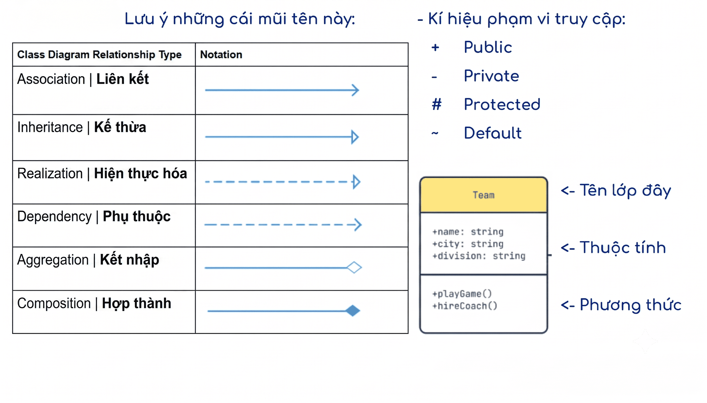

> [!CAUTION]
> **BẪY THƯỜNG GẶP:**
> Liên kết Bao gồm (`<<include>>`) và Mở rộng (`<<extend>>`) **không** phải là thành phần của sơ đồ lớp (Class Diagram). Chúng chỉ tồn tại giữa các ca sử dụng trong sơ đồ ca sử dụng (Use Case Diagram).

> [!TIP]
> **Mức độ hiển thị & Khả năng truy cập liên kết:**
> - Ký hiệu chữ `x` trên đầu liên kết: Biểu thị **không truy cập/điều hướng được** đối tượng ở đầu liên kết tương ứng (Unnavigable connection).

---

## 📌 PHẦN 2: KHẢO SÁT VÀ PHÂN TÍCH (BÀI 3 - BÀI 5)

### 1. Mô hình hóa nghiệp vụ (Business Modeling - Bài 3)
*   **Business Actor (Đối tác nghiệp vụ):** Thực thể bên ngoài (khách hàng, đối tác, hệ thống ngoài) tương tác với tổ chức/doanh nghiệp.
*   **Business Worker (Thừa tác viên nghiệp vụ):** Một vai trò hoặc vị trí nhân sự bên trong doanh nghiệp thực hiện các công việc thuộc quy trình nghiệp vụ.
*   **Business Use Case (Ca nghiệp vụ):** Quy trình làm việc hoặc chuỗi hoạt động của tổ chức nhằm đem lại một giá trị thực tiễn cho đối tác nghiệp vụ.

### 2. Khảo sát yêu cầu phần mềm & Sơ đồ ca sử dụng hệ thống (Bài 4)
*   **Actor (Tác nhân hệ thống):** Thực thể bên ngoài (người dùng, thiết bị phần cứng, phần mềm khác) trực tiếp tương tác với hệ thống phần mềm đang xây dựng.
*   **System Use Case (Ca sử dụng hệ thống):** Nhóm các chức năng hệ thống thực hiện nhằm mang lại một kết quả có giá trị đối với Actor.
*   **Phân loại ca sử dụng:**
    *   **Essential Use Case (Ca sử dụng thiết yếu):** Mô tả quy trình nghiệp vụ độc lập hoàn toàn với giao diện và công nghệ. Được xác định ở mức **Khái quát (Summary)** và **Chi tiết (Detailed)** trong **Pha Phân tích**.
    *   **Real Use Case (Ca sử dụng thực tế):** Mô tả quy trình gắn liền với thiết kế giao diện (UI) và giải pháp công nghệ cụ thể. Xây dựng trong **Pha Thiết kế**.
*   **Quy tắc đặt tên Ca sử dụng (Use Case Naming):** Đặt tên bắt đầu bằng **động từ hành động + cụm danh từ** (Ví dụ: `Chọn Sản Phẩm`, `Đăng Ký Học`). Tránh dùng chỉ danh từ (`Sản Phẩm`) hoặc đưa cả chủ ngữ vào (`Khách hàng chọn sản phẩm`).
*   **Phân biệt Yêu cầu Chức năng (Functional) và Phi chức năng (Non-functional):**
    *   *Yêu cầu Chức năng (Functional):* Mô tả trực tiếp hành vi, chức năng phần mềm cung cấp (Ví dụ: "Sinh viên xem thời khóa biểu", "Sinh viên đăng ký thực tập doanh nghiệp").
    *   *Yêu cầu Phi chức năng (Non-functional):* Mô tả ràng buộc, giới hạn của hệ thống về giao diện, hiệu năng, bảo mật, thiết bị, môi trường vận hành (Ví dụ: "Sinh viên tương tác với hệ thống bằng thiết bị di động", "Sử dụng cỡ chữ tối thiểu là 12 pt", "Hệ thống phản hồi yêu cầu tìm kiếm trong giới hạn 1 giây").
*   **Mô tả Hộp đen (Black-box) vs Hộp trắng (White-box):**
    *   *Black-box (Hộp đen):* Chỉ mô tả luồng sự kiện/tương tác ở biên hệ thống giữa Actor và phần mềm, không thể hiện hoạt động xử lý hay cấu trúc bên trong.
    *   *White-box (Hộp trắng):* Chỉ rõ cấu trúc hoặc sự tương tác của các thành phần bên trong hệ thống để đáp ứng ca sử dụng.
*   **Mối quan hệ giữa các Ca sử dụng:**
    *   **Quan hệ Bao gồm (`<<include>>`):** Ca sử dụng nguồn (Do A) bắt buộc luôn kéo theo việc thực hiện ca sử dụng đích (Do B).
        *   *Ký hiệu:* Mũi tên nét đứt hướng từ ca sử dụng gốc sang ca sử dụng bao gồm: $Do\ A \xrightarrow{\text{<<include>>}} Do\ B$.
    *   **Quan hệ Mở rộng (`<<extend>>`):** Ca sử dụng mở rộng (Do B) chỉ được thực hiện dưới các điều kiện cụ thể (điểm mở rộng) khi thực hiện ca sử dụng gốc (Do A).
        *   *Ký hiệu:* Mũi tên nét đứt hướng **ngược lại** từ ca sử dụng mở rộng về ca sử dụng gốc: $Do\ B \xrightarrow{\text{<<extend>>}} Do\ A$.

### 3. Phân tích ca sử dụng & Lớp phân tích (Bài 5)
Để thiết kế độc lập với công nghệ ở pha phân tích, ta áp dụng mô hình phân tích **ECB (Entity - Control - Boundary)** gồm 3 loại lớp:
1.  **Boundary Class (Lớp Biên):** Trung gian tương tác giữa Actor bên ngoài và hệ thống (Ví dụ: giao diện màn hình nhập liệu, cổng API nhận request).
    *   *Ký hiệu đồ họa:* Hình tròn có một gạch thẳng đứng và một gạch ngang bên trái ($\mathord{\vdash}\hspace{-0.2em}\bigcirc$).
2.  **Control Class (Lớp Điều khiển):** Chứa logic điều phối luồng công việc, xử lý nghiệp vụ của ca sử dụng, kết nối giữa lớp Biên và lớp Thực thể.
    *   *Ký hiệu đồ họa:* Hình tròn có mũi tên xoay vòng phía trên ($\circlearrowright$).
3.  **Entity Class (Lớp Thực thể):** Lưu trữ thông tin và trạng thái lâu dài của hệ thống (Persistent). Thường ánh xạ trực tiếp tới các bảng trong CSDL.
    *   *Ký hiệu đồ họa:* Hình tròn có một gạch nằm ngang phía dưới ($\underline{\bigcirc}$).

> [!TIP]
> **SO SÁNH NHANH VỚI MÔ HÌNH MVC:**
> Nếu đã quen với kiến trúc MVC, bạn có thể liên hệ tương đương như sau để dễ nhớ bài học:
> - **Boundary (Lớp Biên) $\approx$ View:** Giao diện tương tác (nhưng Boundary rộng hơn, gồm cả cổng API, Gateway...).
> - **Control (Lớp Điều khiển) $\approx$ Controller:** Điều phối luồng xử lý logic của ca sử dụng.
> - **Entity (Lớp Thực thể) $\approx$ Model:** Quản lý dữ liệu và lưu trữ (Entity là các Persistent Objects).
> - *Điểm khác biệt chính:* **ECB** dùng ở **Pha Phân tích** (phác thảo logic độc lập công nghệ), còn **MVC** dùng ở **Pha Thiết kế & Cài đặt** (kiến trúc viết code cụ thể).

*Ví dụ minh họa Phân tích lớp ECB (Boundary-Control-Entity) cho ca sử dụng:*
*   **Sơ đồ lớp phân tích (Analysis Class Diagram):**
    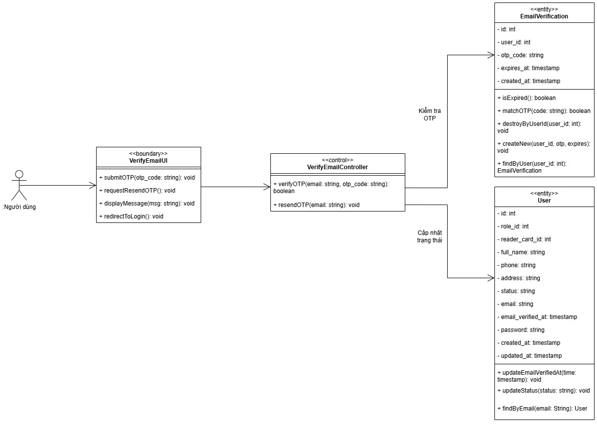
*   **Sơ đồ tuần tự phân tích (Analysis Sequence Diagram):**
    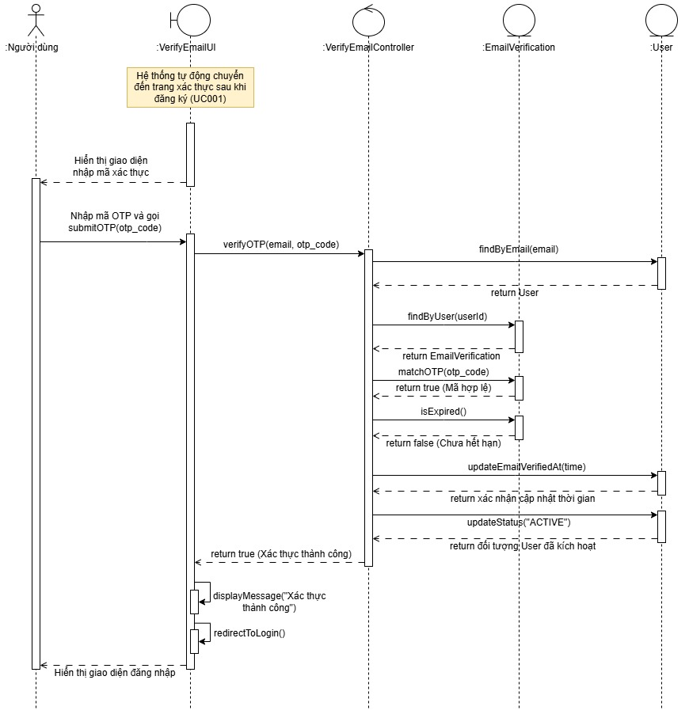

---

## 📌 PHẦN 3: THIẾT KẾ VÀ CÀI ĐẶT (BÀI 6 - BÀI 9)

### 1. Thiết kế Kiến trúc phần mềm & Mô hình "4+1 View" (Bài 6)
Để thiết kế một hệ thống lớn, kiến trúc được biểu diễn qua 5 góc nhìn bổ trợ lẫn nhau:
*   **Logical View (Góc nhìn logic):** Thể hiện cấu trúc lớp, gói, quan hệ kế thừa/kết hợp. Hỗ trợ nhà thiết kế/lập trình hiểu cấu trúc hệ thống.
*   **Implementation View (Góc nhìn thực hiện/phát triển):** Mô tả cách phân chia mã nguồn thành các file, thư viện, mô-đun phát triển thực tế.
*   **Process View (Góc nhìn tiến trình):** Giải quyết vấn đề tương tranh, luồng hoạt động, đồng bộ hóa và hiệu năng hệ thống.
*   **Deployment View (Góc nhìn triển khai):** Cấu hình phần cứng vật lý, topo mạng và sự phân bố của các thành phần phần mềm trên các node vật lý.
*   **Use-case View (Góc nhìn ca sử dụng - Góc nhìn trung tâm "+1"):** Dùng để liên kết, kiểm tra tính đúng đắn và kiểm thử toàn bộ kiến trúc.

### 2. Quy tắc kiến trúc phân tầng (Layering Approach)
Trong mô hình kiến trúc phân tầng tiêu chuẩn, hệ thống được chia thành các tầng chính từ trên xuống dưới:
1.  **Application Subsystems (Tầng ứng dụng / Tương tác người - máy):** Quản lý giao diện UI.
2.  **Business-Specific (Tầng nghiệp vụ đặc thù):** Chứa các dịch vụ, nghiệp vụ cốt lõi của doanh nghiệp.
3.  **Middleware (Tầng trung gian):** Các lớp quản lý dữ liệu, lớp tiện ích, dịch vụ phân tán.
4.  **System Software (Tầng phần mềm hệ thống):** Hệ điều hành, thiết bị phần cứng, driver.

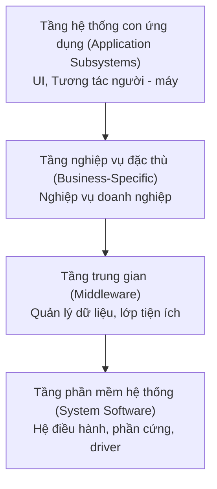

> [!IMPORTANT]
> **Nguyên lý Khả năng hiển thị (Visibility):**
> Sự phụ thuộc (dependencies) **chỉ được phép diễn ra từ trên xuống dưới hoặc trong cùng một tầng**. Các tầng bên dưới (ví dụ như Middleware/Quản lý dữ liệu) hoàn toàn độc lập và không phụ thuộc ngược lại vào các tầng bên trên nó (Lĩnh vực nghiệp vụ).

### 3. Thiết kế ca sử dụng chi tiết & Sơ đồ tương tác (Bài 7)
Ở pha thiết kế, ta tinh chỉnh các lớp ECB thành các lớp thiết kế cụ thể và xây dựng Sơ đồ tuần tự (Sequence Diagram).

*   **Các loại Thông điệp (Messages) trong Sơ đồ tương tác:**
    *   *Synchronous Message (Đồng bộ):* Đối tượng gửi đợi phản hồi từ đối tượng nhận. **Yêu cầu đối tượng nhận thực hiện công việc**. (Mũi tên nét liền đầu tam giác đặc).
    *   *Asynchronous Message (Không đồng bộ):* Đối tượng gửi tiếp tục công việc ngay. **Yêu cầu đối tượng nhận thực hiện công việc**. (Mũi tên nét liền đầu nhọn mở).
    *   *Found Message (Tìm thấy):* Điểm gửi không xác định, chỉ xác định đối tượng nhận để **thực hiện công việc**.
    *   *Reply / Return Message (Trả về):* Chỉ phản hồi kết quả. **KHÔNG yêu cầu đối tượng nhận thực hiện công việc**. (Mũi tên nét đứt đầu nhọn mở).
*   **Đặc trưng sơ đồ tuần tự và sơ đồ giao tiếp:**
    *   *Ký tự `X` trên trục thời gian (lifeline):* Đánh dấu thời điểm **hủy đối tượng** (Destruction Event).
    *   *Chỉ số thông điệp đồng thời trong Sơ đồ giao tiếp (Communication Diagram):* Sử dụng hậu tố chữ cái (ví dụ: `1a`, `1b` hoặc `m1`, `m2` chạy song song) để biểu thị các thông điệp được **gửi đồng thời**.

### 4. Thiết kế lớp chi tiết & Sơ đồ máy trạng thái (Bài 8)
*   **Thiết kế lớp:** Đặc tả rõ kiểu dữ liệu của thuộc tính, tham số truyền vào và kiểu trả về của phương thức.
*   **State Machine Diagram (Sơ đồ máy trạng thái):**
    *   Dùng để mô tả vòng đời của **một đối tượng duy nhất** có hành vi phức tạp phụ thuộc vào trạng thái.
    *   **Thành phần chính:**
        *   *State (Trạng thái):* Tình trạng hoặc tình huống trong vòng đời đối tượng (ví dụ: Đang chờ, Đã thanh toán).
        *   *Transition (Sự chuyển trạng thái):* Mối quan hệ chuyển đổi từ trạng thái này sang trạng thái khác.
        *   *Event (Sự kiện):* Tác nhân kích hoạt chuyển trạng thái.
        *   *Guard Condition (Điều kiện ràng buộc):* Điều kiện Boolean đặt trong ngoặc vuông `[ ]`. Sự chuyển trạng thái chỉ xảy ra nếu điều kiện này đúng.
        *   *Action (Hành động):* Hoạt động tính toán diễn ra tức thời trong quá trình chuyển dịch hoặc khi vào/ra trạng thái.

### 5. Thiết kế cơ sở dữ liệu quan hệ (Bài 9)
Ánh xạ mô hình hướng đối tượng sang hệ cơ sở dữ liệu quan hệ (RDBMS):
*   **Lớp persistent (lớp lưu trữ)** $\rightarrow$ **Table (Bảng)**.
*   **Thuộc tính** $\rightarrow$ **Column (Cột)**.
*   **Khóa chính (Primary Key):** Phải được xác định cho mỗi bảng để đảm bảo tính duy nhất.
*   **Mối liên kết (Association):**
    *   *Liên kết 1..1 hoặc 1..* $\rightarrow$ Dùng **Khóa ngoại (Foreign Key)** ở phía nhiều.
    *   *Liên kết nhiều-nhiều (\*..\*)* $\rightarrow$ Tạo một **Bảng trung gian (Association Table)** chứa hai khóa ngoại trỏ tới hai bảng gốc.
*   **Ánh xạ mối quan hệ kế thừa (Generalization/Inheritance) sang RDBMS:**
    1.  **Single Table per Class Hierarchy (Một bảng cho cả cây kế thừa):** Tất cả thuộc tính của lớp cha và các lớp con lưu chung trong một bảng. Dùng thêm một cột phân biệt (Discriminator column) để biết dòng dữ liệu thuộc lớp con nào. (Hiệu năng truy vấn tốt nhất nhưng gây lãng phí ô nhớ Null).
    2.  **Table per Concrete Class (Mỗi lớp cụ thể một bảng):** Lớp cha không có bảng riêng (hoặc chỉ các lớp cụ thể mới có). Mỗi bảng lớp con chứa toàn bộ các thuộc tính kế thừa và thuộc tính riêng của nó.
    3.  **Table per Subclass / Joined (Bảng riêng kết hợp JOIN):** Lớp cha có một bảng riêng chứa thuộc tính chung. Mỗi lớp con có một bảng riêng chứa các thuộc tính riêng của nó và khóa ngoại (đồng thời là khóa chính) liên kết trỏ về bảng lớp cha. (Bảo toàn chuẩn hóa dữ liệu tốt nhất nhưng hiệu năng chậm do phải JOIN nhiều bảng).
    - **Tính toán số thuộc tính tối thiểu khi làm phẳng (Single Table per Class Hierarchy):**
      $\text{Số thuộc tính tối thiểu của lớp thu được} = \sum(\text{Thuộc tính riêng biệt của tất cả các lớp trong cây kế thừa}) + 1\ \text{(Cột discriminator)}$.

      *Ví dụ:* Giả sử ta có cây kế thừa sau:
      *   Lớp cha: `Nhân viên` (có thuộc tính: `id`, `tên`)
      *   Lớp con 1: `Quản lý` (có thuộc tính riêng: `phòng ban`)
      *   Lớp con 2: `Kỹ thuật` (có thuộc tính riêng: `ngôn ngữ lập trình`)
      
      Khi làm phẳng cây kế thừa này thành một bảng duy nhất là `NhanVien`, bảng này sẽ gồm các cột: `id`, `tên`, `phòng ban`, `ngôn ngữ lập trình`, và cột discriminator đặt tên là `loai_nhan_vien` (Tổng cộng = 2 thuộc tính cha + 2 thuộc tính riêng các con + 1 discriminator = 5 cột).
      
      Dữ liệu lưu trữ trong bảng CSDL sẽ như sau:
      
      | id | tên | phòng ban | ngôn ngữ lập trình | loai_nhan_vien (Discriminator) |
      | :--- | :--- | :--- | :--- | :--- |
      | 1 | Nguyễn Văn A | IT | NULL | QuanLy |
      | 2 | Trần Thị B | NULL | Java | KyThuat |

---

## 📌 PHẦN 4: HÌNH DẠNG HÌNH HỌC VÀ TIÊU CHUẨN UML PHỤ

### 1. Bảng ký hiệu hình học đầy đủ
| Hình ảnh minh họa | Ký hiệu hình học | Ý nghĩa phần tử | Mô tả & Sơ đồ áp dụng |
| :--- | :--- | :--- | :--- |
| 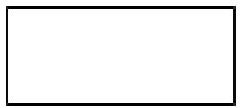 | **Hình chữ nhật** | **Class (Lớp)** | Biểu diễn một Lớp trong **Sơ đồ lớp (Class Diagram)**. Thường chia thành các ngăn chứa tên lớp, thuộc tính và phương thức. |
| 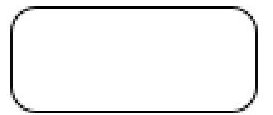 | **Hình chữ nhật bo góc** | **Activity / Action / State** | Biểu diễn các nút Hoạt động/Hành động hoặc Trạng thái trong **Sơ đồ hoạt động (Activity Diagram)** hoặc **Sơ đồ trạng thái (State Diagram)**. |
| 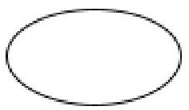 | **Hình elip (Oval)** | **Use Case (Ca sử dụng)** | Biểu diễn ca sử dụng/quy trình nghiệp vụ trong **Sơ đồ ca sử dụng (Use Case Diagram)**. |
| 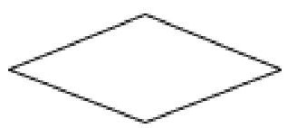 | **Hình thoi rỗng** | **Decision Node / Aggregation** | Làm nút quyết định rẽ nhánh trong **Sơ đồ hoạt động** hoặc biểu diễn quan hệ kết nhập (Aggregation) trong **Sơ đồ lớp**. |
| 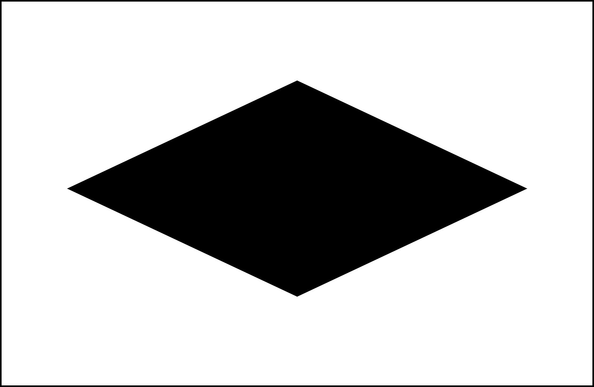 | **Hình thoi đặc** | **Composition (Hợp thành)** | Biểu diễn quan hệ hợp thành (Composition) có ràng buộc chặt chẽ về vòng đời trong **Sơ đồ lớp (Class Diagram)**. |
| 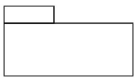 | **Hình hộp có tab nhỏ** | **Package (Gói)** | Biểu diễn một gói (Package) để phân nhóm các phần tử logic trong **Sơ đồ gói (Package Diagram)**. |

### 2. Bảng phân loại sơ đồ UML (Cấu trúc tĩnh vs Hành vi động)
| Nhóm Sơ đồ | Các Sơ đồ thuộc nhóm | Đặc điểm |
| :--- | :--- | :--- |
| **Cấu trúc tĩnh**<br>(Static Structure) | - Sơ đồ lớp (Class Diagram)<br>- Sơ đồ đối tượng (Object Diagram)<br>- Sơ đồ gói (Package Diagram)<br>- Sơ đồ thành phần (Component Diagram)<br>- Sơ đồ triển khai (Deployment Diagram) | Mô tả cấu trúc vật lý hoặc logic của hệ thống tại một thời điểm, không thay đổi theo thời gian. |
| **Hành vi động**<br>(Behavioral / Interaction) | - Sơ đồ ca sử dụng (Use Case Diagram)<br>- Sơ đồ tuần tự (Sequence Diagram)<br>- Sơ đồ hoạt động (Activity Diagram)<br>- Sơ đồ trạng thái (State Machine Diagram)<br>- Sơ đồ tương tác / truyền thông (Communication Diagram) | Mô tả sự thay đổi trạng thái, tương tác hoặc tiến trình thực hiện công việc của các thực thể theo thời gian. |

### 3. Minh họa các loại biểu đồ UML (Bài 1)

| Hình ảnh minh họa | Loại biểu đồ & Chú thích |
| :--- | :--- |
| 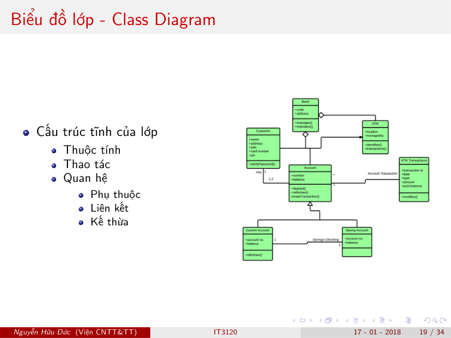 | **Biểu đồ lớp (Class Diagram)**<br>- *Mô tả:* Biểu diễn cấu trúc tĩnh của các lớp, bao gồm thuộc tính, thao tác (phương thức) và các mối quan hệ (phụ thuộc, liên kết, kế thừa/khái quát hóa, kết nhập, hợp thành). |
| 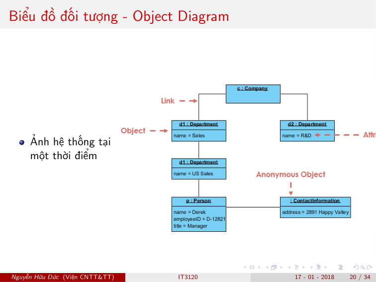 | **Biểu đồ đối tượng (Object Diagram)**<br>- *Mô tả:* Biểu diễn ảnh chụp hệ thống tại một thời điểm cụ thể, bao gồm các đối tượng cụ thể và liên kết thực tế giữa chúng. |
| 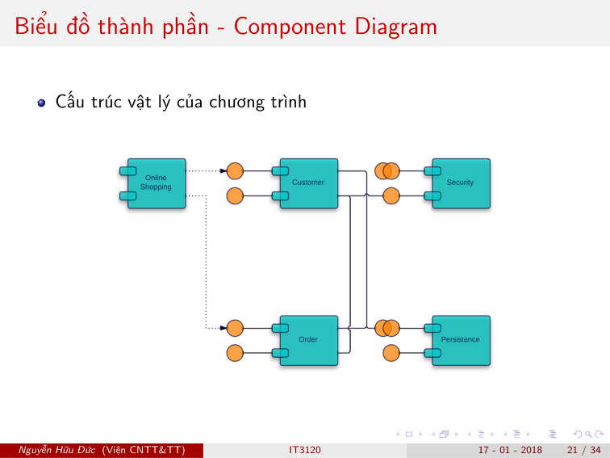 | **Biểu đồ thành phần (Component Diagram)**<br>- *Mô tả:* Biểu diễn cấu trúc vật lý của chương trình nguồn, cách tổ chức và phụ thuộc giữa các thành phần phần mềm. |
| 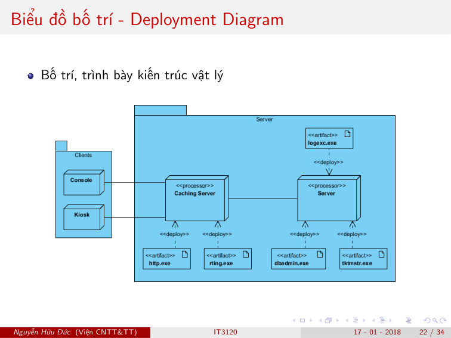 | **Biểu đồ bố trí / triển khai (Deployment Diagram)**<br>- *Mô tả:* Mô tả cách bố trí, phân bố vật lý của các thành phần phần mềm trên các node phần cứng thực tế và mạng. |
| 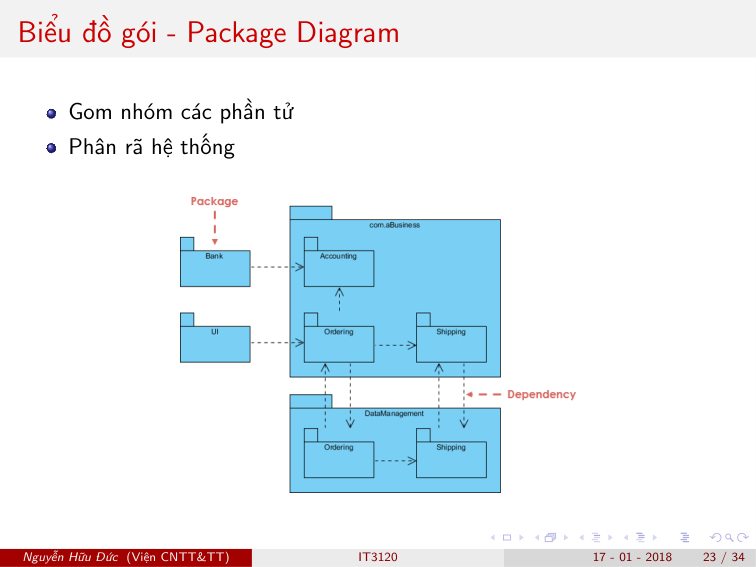 | **Biểu đồ gói (Package Diagram)**<br>- *Mô tả:* Gom nhóm các phần tử logic, hỗ trợ phân rã và tổ chức hệ thống lớn thành các phần nhỏ hơn. |
| 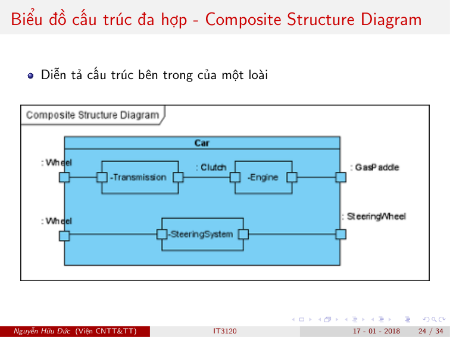 | **Biểu đồ cấu trúc đa hợp (Composite Structure Diagram)**<br>- *Mô tả:* Diễn tả cấu trúc cộng tác bên trong của một lớp/phần tử phân loại (classifier). |
| 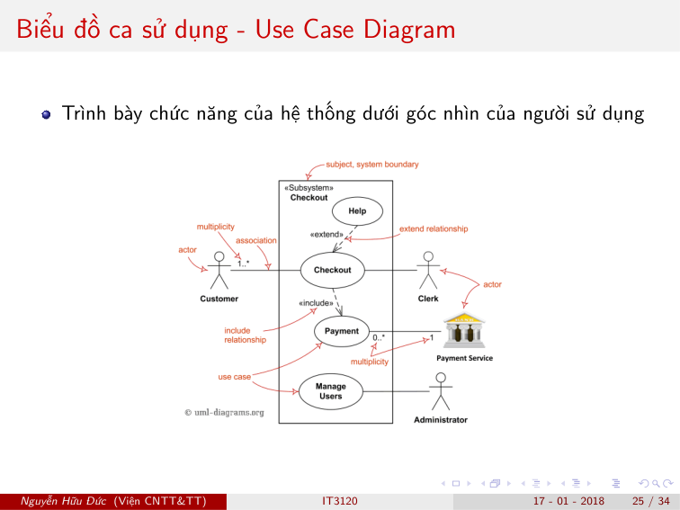 | **Biểu đồ ca sử dụng (Use Case Diagram)**<br>- *Mô tả:* Trình bày các chức năng của hệ thống dưới góc nhìn của người sử dụng/tác nhân bên ngoài. |
| 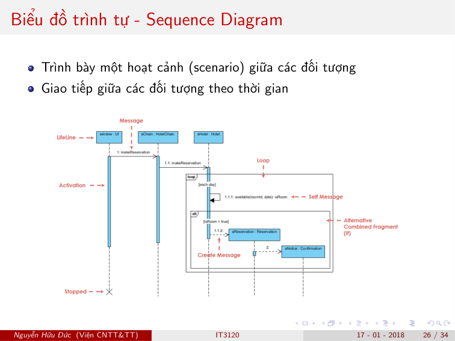 | **Biểu đồ trình tự (Sequence Diagram)**<br>- *Mô tả:* Trình bày một kịch bản/hoạt cảnh tương tác động giữa các đối tượng theo thứ tự trục thời gian. |
| 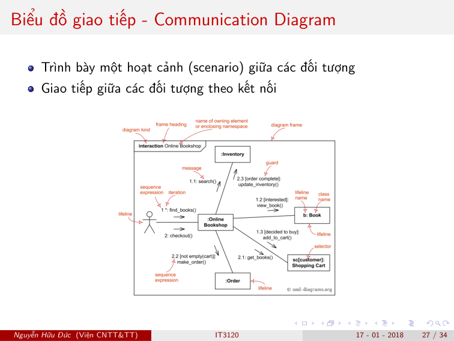 | **Biểu đồ giao tiếp (Communication Diagram)**<br>- *Mô tả:* Trình bày tương tác động giữa các đối tượng tập trung theo các đường nối/kết nối giữa chúng (được đánh chỉ số thứ tự). |
| 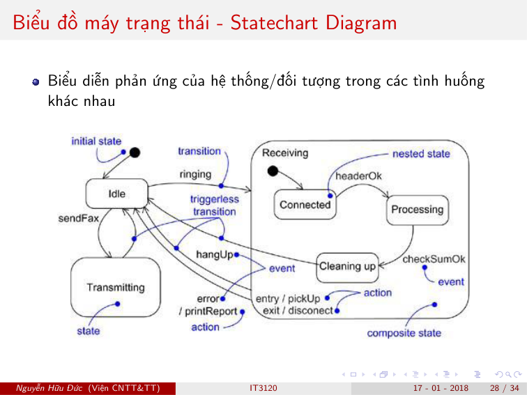 | **Biểu đồ máy trạng thái (Statechart Diagram)**<br>- *Mô tả:* Biểu diễn vòng đời và cách hệ thống/đối tượng phản ứng, chuyển dịch trạng thái trước các sự kiện khác nhau. |
| 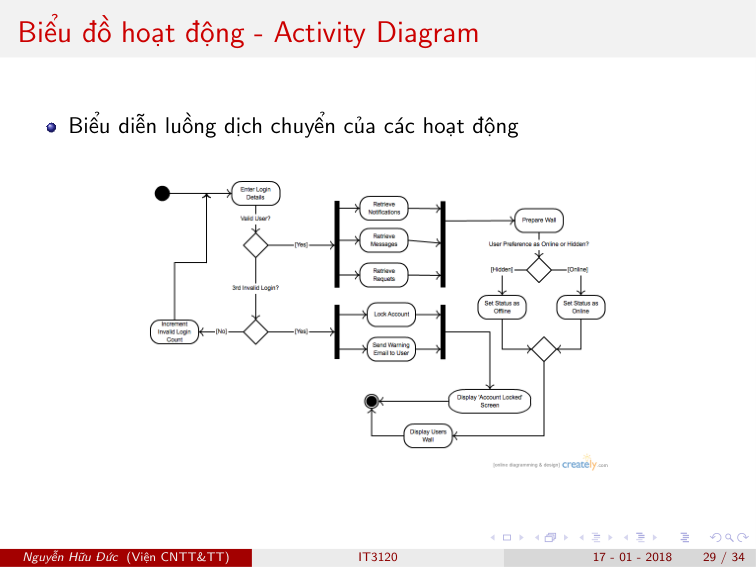 | **Biểu đồ hoạt động (Activity Diagram)**<br>- *Mô tả:* Biểu diễn luồng dịch chuyển của các hoạt động/tiến trình nghiệp vụ trong hệ thống. |
| 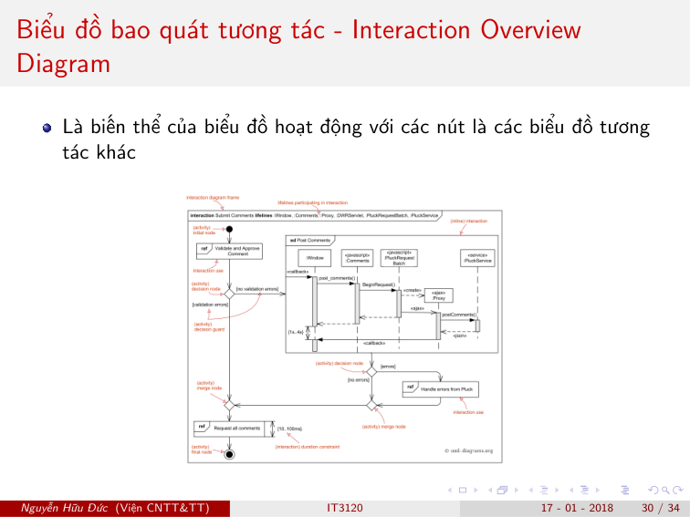 | **Biểu đồ bao quát tương tác (Interaction Overview Diagram)**<br>- *Mô tả:* Biến thể của biểu đồ hoạt động, trong đó các nút đại diện cho các biểu đồ tương tác khác (như sơ đồ tuần tự). |
| 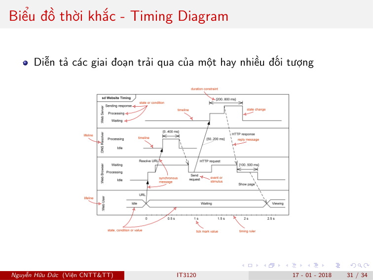 | **Biểu đồ thời khắc (Timing Diagram)**<br>- *Mô tả:* Diễn tả sự thay đổi trạng thái và ràng buộc thời gian cụ thể trải qua của một hay nhiều đối tượng. |

---

## 📌 PHẦN 5: NGÔN NGỮ RÀNG BUỘC ĐỐI TƯỢNG (OCL)

Khi phân tích sơ đồ đối tượng kết hợp biểu thức OCL, cần lưu ý:
1.  **Biến `self`:** Đại diện cho đối tượng ngữ cảnh đang xét hiện tại.
2.  **Toán tử `->select(điều kiện)`:** Lọc tập hợp các đối tượng liên kết thỏa mãn điều kiện và trả về một tập hợp con chứa các đối tượng đó.
3.  **Cách tính kết quả biểu thức OCL:** Phải duyệt qua từng trường hợp cụ thể của `self` để tính toán giá trị của tập hợp kết quả:
    *   *Ví dụ mẫu (Từ đề thi):* Trong ngữ cảnh lớp **Airport** và sơ đồ đối tượng dưới đây, hãy cho biết số lượng đối tượng được trả về cho biểu thức OCL sau:
        
        $$self.departingFlights->select(duration < 6)$$
        
        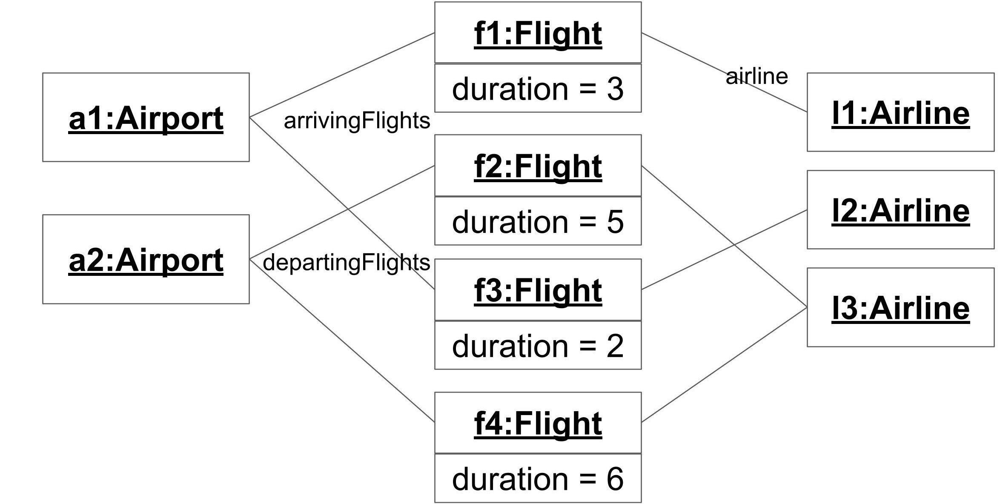
        
        *   **Phân tích thực tế theo đường nối trên sơ đồ:**
            *   `a1:Airport` liên kết với `{f1, f3}` qua vai trò `arrivingFlights` (đường chéo từ `a1` xuống `f3`).
            *   `a2:Airport` liên kết với `{f2, f4}` qua vai trò `departingFlights` (đường chéo từ `a2` lên `f2`).
        *   **Đánh giá biểu thức với `self = a2:Airport` (đối tượng có chuyến bay đi):**
            *   Tập `self.departingFlights` của `a2` là `{f2, f4}`.
            *   `f2` có `duration = 5 < 6` (Thỏa mãn).
            *   `f4` có `duration = 6` (Loại vì không nhỏ hơn 6).
            *   $\rightarrow$ Kết quả `select` trả về tập `{f2}` có kích thước (size) = **1**.

---

## 📌 PHẦN 6: CÁC MẪU THIẾT KẾ (DESIGN PATTERNS) PHỔ BIẾN
Dưới chất lượng thiết kế của học phần, hãy ghi nhớ các mẫu sau:
*   **Prototype (Nguyên mẫu):** Sử dụng một hàm nhân bản/sao chép đối tượng mẫu có sẵn thay vì triển khai quá nhiều hàm tạo (constructors) với các bộ giá trị mặc định khác nhau cho nhiều trường hợp.
*   **Adapter (Lớp chuyển đổi):** Đóng gói một lớp sẵn có (thường chứa các thuật toán phức tạp) để cung cấp một giao diện mới tương thích với hệ thống mà không phải sửa đổi mã nguồn của lớp sẵn có đó.
*   **Facade (Mặt tiền):** Che giấu sự phức tạp của các lớp bên trong một subsystem và cung cấp một giao diện đơn giản ra bên ngoài cho các client gọi.
*   **Proxy (Đại diện):** Cung cấp đối tượng thay thế hoặc giữ chỗ để kiểm soát và quản lý quyền truy cập tới đối tượng thực.

---

## 📌 PHẦN 7: THIẾT GIAO DIỆN & TẦNG TRUY CẬP DỮ LIỆU
*   **Tương tác hệ thống ngoại (External System):** Để các tác nhân là các hệ thống ngoại tương tác với hệ thống đang phát triển, hình thức giao diện thường triển khai là **các cổng API**.
*   **Tầng truy cập và quản lý dữ liệu (DAM/DAO - Data Access Module):** Các lớp trong tầng này giúp nới lỏng phụ thuộc (coupling) giữa tầng lĩnh vực nghiệp vụ (domain) và cơ sở dữ liệu, cho phép thay đổi cơ sở dữ liệu mà không phải sửa đổi các lớp lĩnh vực nghiệp vụ.

---

## 📌 PHẦN 8: BỔ SUNG CÁC CHỦ ĐỀ ÔN TẬP BỔ TRỢ (DÀNH CHO ĐỀ THI CUỐI KỲ)

### 1. Bảng Tiêu chí Lựa chọn Phương pháp Phát triển (SDLC)
Theo giáo trình của *Alan Dennis, Barbara Haley Wixom, Roberta M. Roth*, việc chọn mô hình phát triển được lượng hóa qua các tiêu chí sau:

| Tiêu chí | Waterfall (Thác nước) | Parallel (Song song) | Phased (Chia pha) | Prototyping (Nguyên mẫu HT) | Throwaway Prototyping (Nguyên mẫu thiết kế) | Agile (XP/Scrum) |
| :--- | :--- | :--- | :--- | :--- | :--- | :--- |
| **Độ rõ ràng của yêu cầu** | Kém (Poor) | Kém (Poor) | Tốt (Good) | Tuyệt vời (Excellent) | Tuyệt vời (Excellent) | Tuyệt vời (Excellent) |
| **Sự quen thuộc công nghệ** | Kém (Poor) | Kém (Poor) | Tốt (Good) | Kém (Poor) | **Tuyệt vời (Excellent)** | Kém (XP)/Tốt (Scrum) |
| **Độ phức tạp hệ thống** | Tốt (Good) | Tốt (Good) | Tốt (Good) | Kém (Poor) | **Tuyệt vời (Excellent)** | Tuyệt vời (XP)/Tốt |
| **Độ tin cậy hệ thống** | Tốt (Good) | Tốt (Good) | Tốt (Good) | Kém (Poor) | **Tuyệt vời (Excellent)** | **Tuyệt vời (XP)** / Tốt |
| **Thời hạn hoàn thành gấp** | Kém (Poor) | Tốt (Good) | **Tuyệt vời (Excellent)** | **Tuyệt vời (Excellent)** | Tốt (Good) | **Tuyệt vời (Excellent)** |
| **Khả năng nhìn thấy tiến độ** | Kém (Poor) | Kém (Poor) | Tuyệt vời (Excellent) | Tuyệt vời (Excellent) | Tốt (Good) | Tuyệt vời (Excellent) |

*   **Độ tin cậy hệ thống:** **Nguyên mẫu thiết kế (Throwaway Prototyping)** là tốt nhất vì nó kết hợp quy trình phân tích và thiết kế nghiêm ngặt với việc tạo các nguyên mẫu kỹ thuật để loại bỏ các lỗi thiết kế thô sơ trước khi viết code chính thức. Trong số các mô hình lặp, **XP** cũng có độ tin cậy tuyệt vời nhờ tích hợp và kiểm thử liên tục (TDD).
*   **Hệ thống phức tạp & Công nghệ mới:** **Nguyên mẫu thiết kế (Throwaway Prototyping)** luôn đạt điểm tuyệt đối vì nó cho phép tạo bản thử nghiệm không dùng lại để làm chủ công nghệ và Stress-test các phương án thiết kế phức tạp.
*   **Đúng thời hạn gấp:** Các mô hình **Chia pha (Phased Development)** và **Nguyên mẫu hệ thống (System Prototyping)** là tốt nhất nhờ cơ chế đóng gói phát hành các phiên bản sớm.

### 2. Độ Ghép Nối (Coupling) và Độ Thống Nhất (Cohesion)

#### A. Độ thống nhất phương thức (Method Cohesion) - Từ tệ nhất đến tốt nhất:
1.  **Ngẫu nhiên (Coincidental Cohesion):** Gộp các mã nguồn hoàn toàn không liên quan gì nhau vào chung một phương thức.
2.  **Lô-gic (Logical Cohesion):** Hàm chứa nhiều hành vi tương tự nhau về logic nhưng khác hẳn nhau về bản chất, phân biệt bằng tham số đầu vào (ví dụ: Hàm `inTaiLieu(int type)` để in cả Báo cáo, Hóa đơn và Thư từ tùy biến `type`).
3.  **Cổ điển / Thời gian (Temporal Cohesion):** Các lệnh được gom vào một hàm chỉ vì chúng luôn xảy ra cùng một thời điểm trong vòng đời hệ thống.
    *   *Ví dụ minh họa:*
        ```java
        public void khoiTaoHeThong() { 
            ketNoiDatabase(); 
            initGiaoDienDangNhap();
            resetBoNhoTam(); 
        }
        ```
4.  **Tiến trình (Procedural Cohesion):** Các câu lệnh thực hiện theo trình tự các bước nhất định nhưng không dùng chung dữ liệu.
5.  **Giao tiếp (Communicational Cohesion):** Các hoạt động bên trong phương thức sử dụng hoặc tạo ra cùng một tập dữ liệu đầu vào/đầu ra.
    *   *Ví dụ minh họa:*
        ```java
        public void phanTichBangDiem(BangDiem bangDiem) {
            double gpaHocKy = tinhGpaHienTai(bangDiem);     
            double gpaTichLuy = tinhGpaTichLuy(bangDiem); 
            System.out.println("Kỳ này: " + gpaHocKy + ", Tích lũy: " + gpaTichLuy); 
        }
        ```
6.  **Tuần tự (Sequential Cohesion):** Kết quả đầu ra của câu lệnh này làm đầu vào trực tiếp cho câu lệnh sau.
7.  **Chức năng (Functional Cohesion):** Tốt nhất. Phương thức chỉ thực hiện duy nhất một hành vi nghiệp vụ rõ ràng, toàn vẹn (ví dụ: `tinhGpa()`).

#### B. Độ thống nhất lớp (Class Cohesion):
*   **Lý tưởng (Ideal Cohesion):** Lớp biểu diễn một khái niệm duy nhất, các thuộc tính và phương thức đều liên kết chặt chẽ xung quanh khái niệm đó.
*   **Hỗn hợp vai trò (Mixed-role Cohesion):** Lớp chỉ có 1 thực thể nhưng thực hiện nhiều vai trò khác nhau.
*   **Hỗn hợp lĩnh vực (Mixed-domain Cohesion):** Lớp chứa cả thuộc tính nghiệp vụ lẫn các thực thể hạ tầng kỹ thuật của hệ thống.
    *   *Ví dụ minh họa:*
        ```java
        class NhanVien {    
            private String maNhanVien;
            private String tenNhanVien;    
            private double luong;
            private java.sql.Connection dbConnection; // Vi phạm mixed-domain do mang kết nối CSDL vào lớp Entity
        }
        ```
*   **Hỗn hợp đối tượng (Mixed-instance Cohesion):** Lớp chứa các thuộc tính/hành vi mà chỉ áp dụng cho một số đối tượng chạy thực tế nhất định, các đối tượng khác để trống.

#### C. Độ ghép nối tương tác giữa các lớp (Coupling) - Từ tốt nhất đến tệ nhất:
1.  **Không có ghép nối trực tiếp (No Direct Coupling):** Hai lớp độc lập hoàn toàn.
2.  **Dữ liệu (Data Coupling):** Phương thức lớp này gọi lớp kia và truyền tham số dạng kiểu dữ liệu nguyên thủy (int, float, String...).
3.  **Dấu ấn (Stamp/Structure Coupling):** Phương thức truyền cả một đối tượng chứa nhiều thuộc tính làm tham số, nhưng phương thức được gọi chỉ sử dụng một vài thuộc tính nhỏ bên trong đối tượng đó.
4.  **Điều khiển (Control Coupling):** Lớp này truyền tham số điều khiển để chỉ định logic chạy cho lớp kia.
5.  **Chung (Common/Global Coupling):** Các lớp phụ thuộc và chia sẻ chung một vùng dữ liệu toàn cục.
6.  **Nội dung / Biểu diễn (Content/Representation Coupling):** Tệ nhất. Một lớp truy cập trực tiếp vào thuộc tính nội bộ công khai (public field) của lớp khác để chỉnh sửa dữ liệu mà không qua phương thức getter/setter đóng gói (ví dụ: `acc.balance = 0.0`).

### 3. Nguyên lý thiết kế SOLID
*   **Single Responsibility Principle (SRP - Đơn trách nhiệm):** Một lớp chỉ nên chịu trách nhiệm cho một tác vụ duy nhất. Lớp `GpaManager` vừa lo đọc file vừa lo tính toán điểm là vi phạm SRP.
*   **Open/Closed Principle (OCP - Đóng/Mở):** Thiết kế cho phép mở rộng tính năng mới thoải mái bằng cách viết thêm code mới (kế thừa, đa hình), nhưng nghiêm cấm việc sửa đổi trực tiếp vào code cũ đang chạy ổn định ("Thêm mới thoải mái, cấm sửa code cũ").
*   **Liskov Substitution Principle (LSP - Thay thế Liskov):** Các đối tượng của lớp con phải thay thế được đối tượng của lớp cha mà không phá vỡ logic chương trình.
    *   *Vi phạm điển hình:* Bài toán **Square-Rectangle Problem** (Hình vuông kế thừa hình chữ nhật) hoặc **Bird-Penguin Problem** (Lớp `Penguin` kế thừa `Bird` nhưng ném ra ngoại lệ `NotImplementedError` khi gọi phương thức `fly()`).
*   **Interface Segregation Principle (ISP - Phân tách Interface):** Chia nhỏ các interface lớn thành nhiều interface chuyên biệt, tránh ép buộc client phải implement các phương thức mà chúng không dùng.
*   **Dependency Inversion Principle (DIP - Đảo ngược phụ thuộc):** Mô-đun cấp cao không phụ thuộc vào mô-đun cấp thấp; cả hai phụ thuộc vào sự trừu tượng (Interface).

### 4. Ánh xạ UML sang CSDL Quan hệ & Thiết kế CSDL
*   **Tính toán số thuộc tính tối thiểu khi làm phẳng cây kế thừa (Single Table per Class Hierarchy):**
    $$\text{Số thuộc tính tối thiểu} = \sum(\text{Thuộc tính riêng biệt của tất cả các lớp trong cây}) + 1\ \text{(Cột phân biệt discriminator)}$$
*   **Thiết kế ánh xạ liên kết 1-1:**
    *   *Thiết lập:* Đặt khóa chính của bảng này làm khóa ngoại có ràng buộc duy nhất (`UNIQUE`) ở bảng kia.
    *   *Đánh đổi:* Nếu chia làm 2 bảng độc lập, hệ thống sẽ cần phép nối `JOIN` khi truy vấn, gây **suy giảm hiệu năng**. Nếu gộp 2 lớp vào 1 bảng duy nhất và mối quan hệ là tùy chọn (0..1), bảng sẽ chứa rất nhiều giá trị rỗng (`NULL`), gây **dư thừa dữ liệu**.

### 5. Sự Đồng Sinh (Connascence) trong Thiết kế Phần mềm
Đồng sinh mô tả sự phụ thuộc chéo giữa các thành phần phần mềm.
*   **Đồng sinh về Quy ước (Connascence of Convention):** Các thành phần phải thống nhất ngầm về một quy ước giá trị (ví dụ: CSDL và giao diện cùng thống nhất dùng `-1` hoặc `-999` để đại diện cho trạng thái "chưa có điểm"). Nếu quy ước ở CSDL đổi, code giao diện cũng phải đổi theo.
*   **Đồng sinh về Kiểu (Connascence of Type):** Thống nhất về kiểu dữ liệu.
*   **Đồng sinh về Vị trí (Connascence of Position):** Thống nhất về thứ tự truyền tham số trong hàm.
*   **Đồng sinh về Giải thuật (Connascence of Algorithm):** Phải sử dụng chung thuật toán (như thuật toán mã hóa/giải mã ở 2 đầu).

### 6. Mô hình hóa IFML & WebML (Giao diện người dùng)
*   **Khu vực (Area):** Một khối chứa logic đại diện cho một nhóm các trang Web hoặc tiểu vùng hiển thị có chung ngữ cảnh sử dụng. Nó hoạt động như một phân vùng loại trừ (XOR container) - tại một thời điểm chỉ cho phép kích hoạt và hiển thị duy nhất một trang con/phân vùng con.
*   **Ký hiệu `[D]` (Default):** Chỉ ra phân vùng hoặc trang mặc định được hiển thị khi vùng chứa nó được kích hoạt.
*   **Ký hiệu `[L]` (Landmark):** Chỉ ra điểm mốc điều hướng, cho phép người dùng chuyển hướng nhanh trực tiếp tới trang/phân vùng này từ bất kỳ vị trí nào khác trong tầm vực mà không cần vẽ đường kết nối tường minh.

### 7. Các chủ đề bổ trợ khác
*   **Quy trình UCP (Use Case Points):** Nhân sự bán thời gian (**part-time staff**) là một hệ số môi trường tiêu cực, làm tăng độ phức tạp giao tiếp và làm **tăng tổng thời gian/nỗ lực** phát triển hệ thống.
*   **Rủi ro chiến lược thiết kế:** Chiến lược "Mua gói phần mềm thương mại" (Packaged Software) có rủi ro cốt lõi là **buộc tổ chức phải thay đổi quy trình nghiệp vụ hiện tại** của mình để tương thích với phần mềm. Chiến lược "Gia công phần mềm" (Outsourcing) đòi hỏi nhà quản lý phải có khả năng **điều phối công việc của nhà cung cấp**.
*   **Thiết kế theo hợp đồng (Design by Contract):** Đối tượng có quyền **từ chối thực thi một thông điệp** nếu phía gọi (client) không đáp ứng được các **tiền điều kiện (Preconditions)** được định nghĩa của phương thức đó.
*   **Ký hiệu UML bổ sung:**
    *   **Thanh đen đặc (Fork/Join Node):** Biểu diễn rẽ nhánh song song (Fork) hoặc gộp các luồng song song (Join) trong Sơ đồ hoạt động.
    *   **Hình trụ tròn:** Ký hiệu biểu diễn Cơ sở dữ liệu (Database) trong sơ đồ UML.
    *   **Mối quan hệ <<manifest>>:** Thể hiện việc một Artifact vật lý chứa/hiện thực hóa một Component logic trong sơ đồ triển khai.