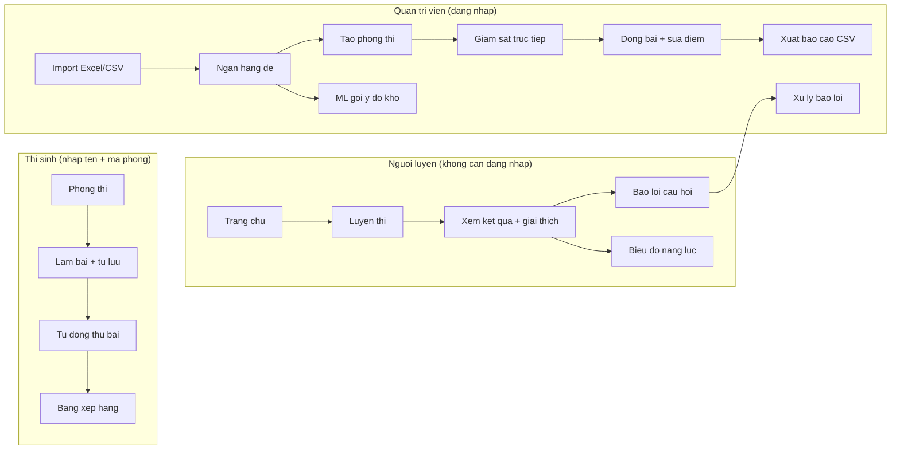
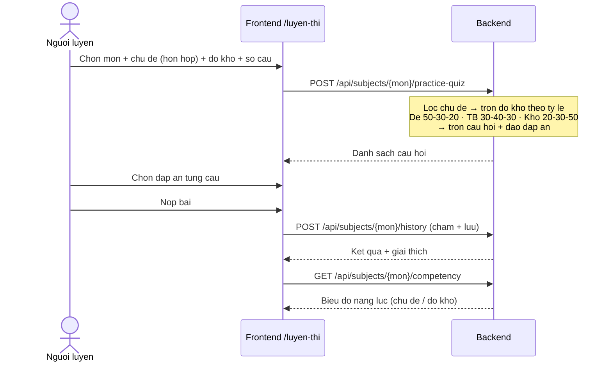
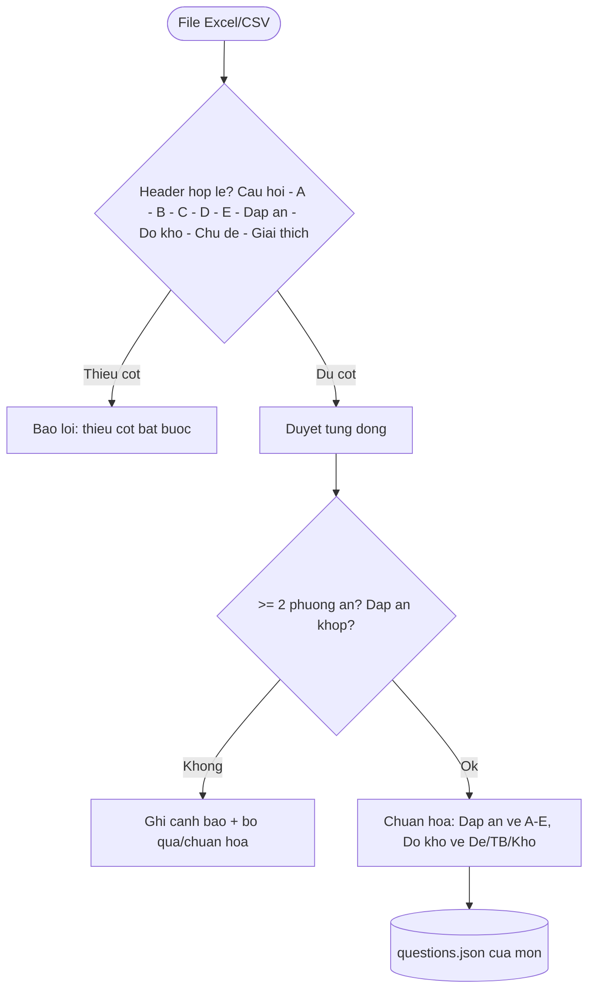
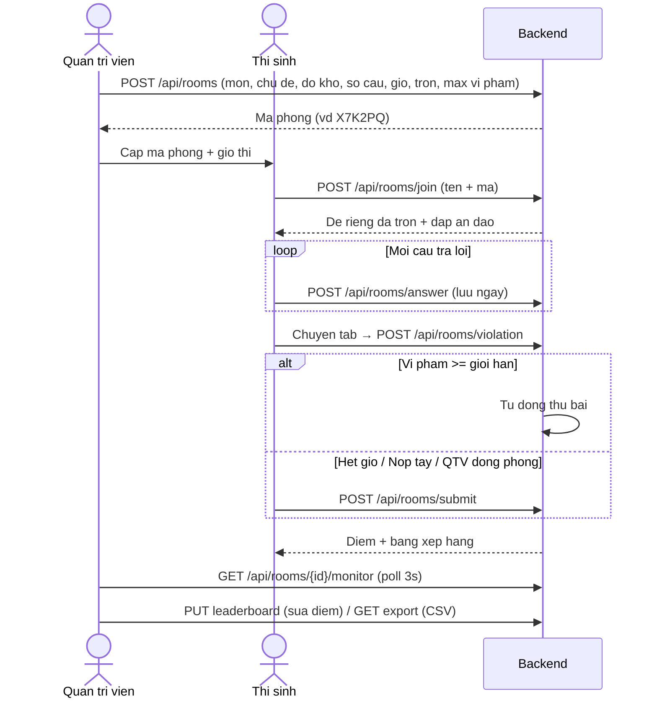
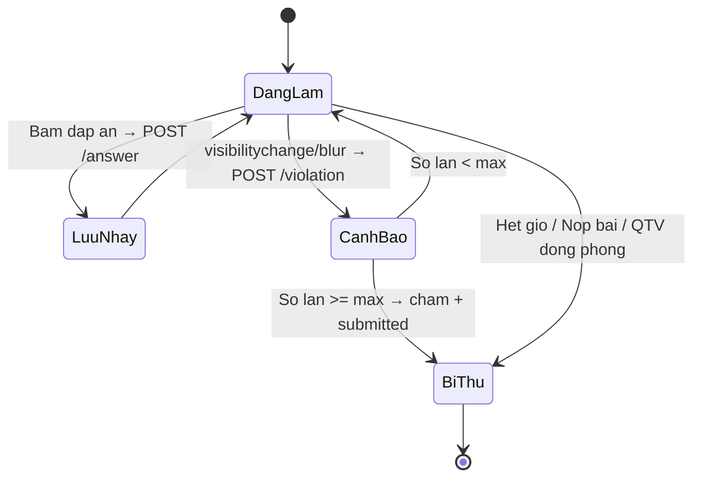
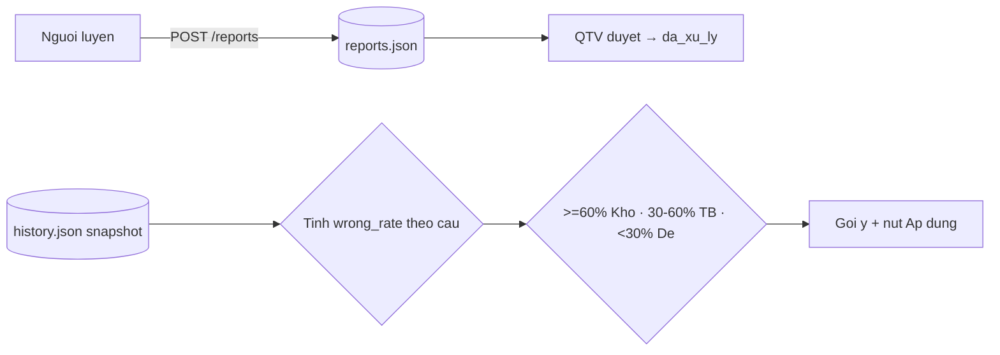

# Flow nghiep vu — EduQuest (luyen thi + phong thi online)

> Tai lieu nay ve cac luong flow nghiep vu cua he thong. Render bang bat ky
> cong cu ho tro Mermaid (VS Code, GitHub, trang `/gioi-thieu`... ).

## 1. Tong quan vai tro

## 2. Luyen thi (khong dang nhap)

## 3. Import de Excel/CSV (format image.png)

## 4. Phong thi online (thi that)

## 5. Chong gian lan + tu dong luu/thu

## 6. Bao loi + ML do kho

